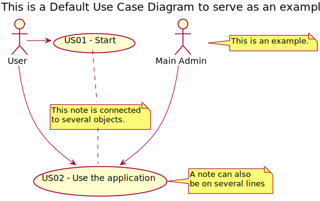

# Use Case Diagram (UCD)

**In the scope of this project, there is a direct relationship of _1 to 1_ between Use Cases (UC) and User Stories (US).**

However, be aware, this is a pedagogical simplification. On further projects and course units might also exist _1 to N **and/or** N to 1 relationships between UC and US.

**Insert below the Use Case Diagram in a SVG format**

**For each UC/US, it must be provided evidences of applying main activities of the software development process (requirements, analysis, design, tests and code). Gather those evidences on a separate file for each UC/US and set up a link as suggested below.**

(Tip: organize the content of each US in a dedicated folder) 

# Use Cases / User Stories
| UC/US  | Description                                                               |                   
|:----|:------------------------------------------------------------------------|
| US01 | [ShortNameOfUS1](US01/US01.md)   |
| US02 | [ShortNameOfUS2](US02/US02.md)  |
| ... | ...|
| US326 | [ShortNameOfUS4](US326/US326.md)|

