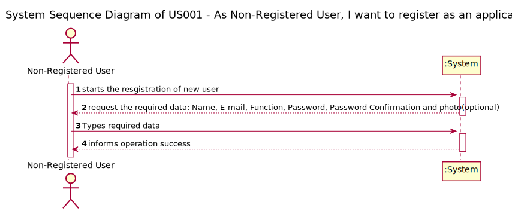

# US001 - As Non-Registered User, I want to register as an application user

## 1. Requirements Engineering

The system should make it possible to register users through a form accessible via a link in the login zone. Each user's registration must request at least the following information:
- Name;
- Function;
- E-mail;
- Password;
- Password confirmation;
- Photo (optional).

Creating accounts in the system must ensure that the email address used is unique. When creating a new user account, the user is automatically associated with the "Visitor"
profile. At the same time, the administrator is notified that an appropriate profile must be
assigned to the created account.
As long as the account is not associated with any more profiles, as a visitor the user will only be
able to send a request to the administrator to be given a profile.

### 1.1. User Story Description

*US001 - As Non-Registered User, I want to register as an application user*

### 1.2. Customer Specifications and Clarifications 

*Insert here any related specification and/or clarification provided by the client together with **your interpretation**. When possible, provide a link to such specifications/clarifications.*

### 1.3. Acceptance Criteria

AC01: email should not exist already in the system;

AC02: email should be as a usual e-mail (i.e. having @...);

AC03:

### 1.4. Found out Dependencies

This is the first User Story therefore it does not have dependencies.
### 1.5 Input and Output Data

Input Data: 
- Name;
- Function;
- E-mail;
- Password;
- Password confirmation;
- Photo (optional).

Output data:
Information of operation success.

### 1.6. System Sequence Diagram (SSD)

[comment]: <> (*Insert here a SSD depicting the envisioned Actor-System interactions and throughout which data is inputted and outputted to fulfill the requirement. All interactions must be numbered.*)

[comment]: <> (### 1.7 Other Relevant Remarks)

[comment]: <> (*Use this section to capture other relevant information that is related with this US such as &#40;i&#41; special requirements ; &#40;ii&#41; data and/or technology variations; &#40;iii&#41; how often this US is held.* )

## 2. OO Analysis

### 2.1. Relevant Domain Model Excerpt 

[comment]: <> (*In this section, it is suggested to present an excerpt of the domain model that is seen as relevant to fulfill this requirement.* )

[comment]: <> (![USXXX-MD]&#40;US001-MD.svg&#41;)

### 2.2. Other Remarks

[comment]: <> (*Use this section to capture some aditional notes/remarks that must be taken into consideration into the design activity. In some case, it might be usefull to add other analysis artifacts &#40;e.g. activity or state diagrams&#41;.* )

## 3. Design - User Story Realization 

### 3.1. Rationale

**The rationale grounds on the SSD interactions and the identified input/output data.**

| Interaction ID | Question: Which class is responsible for... | Answer  | Justification (with patterns)  |
|:-------------  |:--------------------- |:------------|:---------------------------- |
| Step 1  		 |	Create and manage System Users |   SystemUserStore  | GRASP - Pure Fabrication / HC + LC                             |
| Step 2  		 |	Iterate with UI | Controller   |  GRASP - Controller                            |
| Step 3  		 |	Create and manage System User Profiles| UserProfileStore |GRASP - Pure Fabrication / HC + LC                              |

[comment]: <> (| Step 4  		 |							 |             |                              |)

[comment]: <> (| Step 5  		 |							 |             |                              |)

[comment]: <> (| Step 6  		 |							 |             |                              |              )

### Systematization ##

According to the taken rationale, the conceptual classes promoted to software classes are: 

 * SystemUserStore
 * UserProfileStore

[comment]: <> ( * Class3)

Other software classes (i.e. Pure Fabrication) identified: 
 * RegisterUserUI  
 * RegisterUserController

## 3.2. Sequence Diagram (SD)

*In this section, it is suggested to present an UML dynamic view stating the sequence of domain related software objects' interactions that allows to fulfill the requirement.* 

## 3.3. Class Diagram (CD)

*In this section, it is suggested to present an UML static view representing the main domain related software classes that are involved in fulfilling the requirement as well as and their relations, attributes and methods.*

# 4. Tests 
*In this section, it is suggested to systematize how the tests were designed to allow a correct measurement of requirements fulfilling.* 

**_DO NOT COPY ALL DEVELOPED TESTS HERE_**

**Test 1:** Check that it is not possible to create an instance of the Example class with empty values. 

    class ExampleFixture : public ::testing::Test {
        TEST_F(ExampleFixture, CreateWithEmptyCode){
            EXPECT_THROW(new Example(L"",L"Example One"),std::invalid_argument);
        }
    }
	

*It is also recommended organizing this content by subsections.* 

# 5. Construction (Implementation)

*In this section, it is suggested to provide, if necessary, some evidence that the construction/implementation is in accordance with the previously carried out design. Furthermore, it is recommeded to mention/describe the existence of other relevant (e.g. configuration) files and highlight relevant commits.*

*It is also recommended to organize this content by subsections.* 

# 6. Integration and Demo 

*In this section, it is suggested to describe the efforts made to integrate this functionality with the other features of the system.*

# 7. Observations

*In this section, it is suggested to present a critical perspective on the developed work, pointing, for example, to other alternatives and or future related work.*

