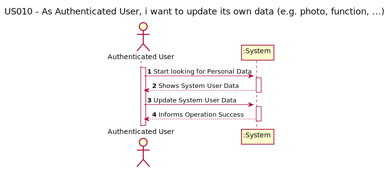
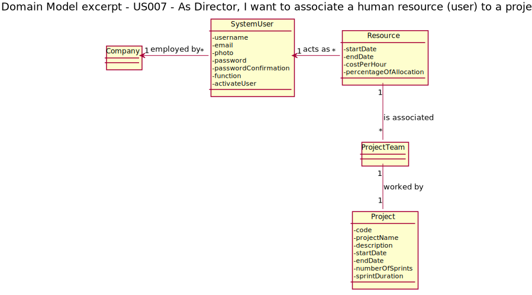
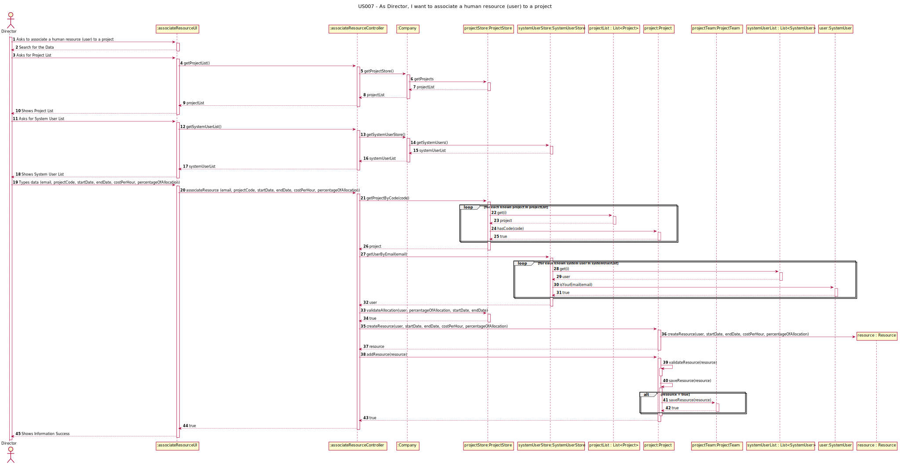
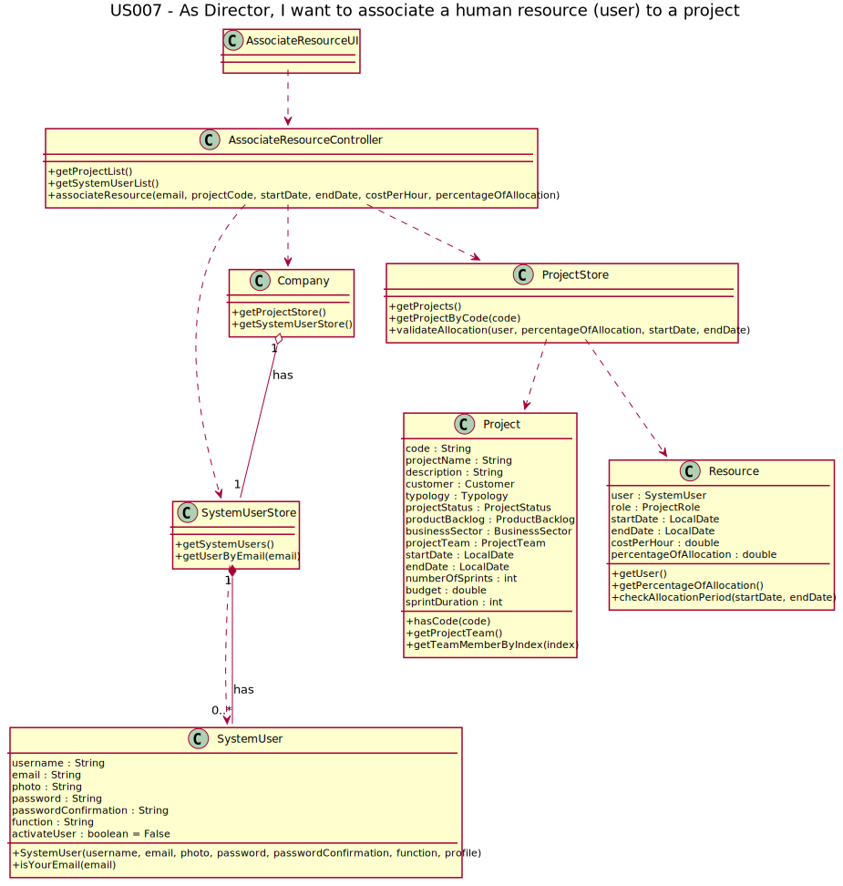

#US 007 - As Director, I want to associate a human resource (user) to a project

## 1. Requirements Engineering

To get access to the system a user must enter credentials in the form of email and password.
After successful authentication, the system should create a session that will allow the user to 
be identified in subsequent requests.

The system should make it possible to register users through a form accessible via a link in the
login zone. Each user's registration must request at least the following information:

 - Name;
 - Function;
 - E-mail;
 - Password;
 - Password confirmation; 
 - Photo (optional).

Creating accounts in the system must ensure that the email address used is unique.

### 1.1. User Story Description

As Director, I want to associate a human resource (user) to a project

### 1.2. Customer Specifications and Clarifications 

The Director is going to associate a human resource to a project 

***Team Ask*** - In order for the Director to be able to associate a user with a project, a list of users is presented. 
The Director chooses a user from this list. However, validation is required to ensure that the selected user has enough 
available hours to allocate to the project. The question is: How should we do this validation? Is a list of all the users 
on the system displayed and if the user selected by the Director does not have enough available hours, should an error 
be displayed and the choice impossible? Or should a list only be presented with users with enough available hours 
to allocate to the project (pre-filtering)?

***PO Answer*** - As for the validations that are proposed, the fact that someone has been added to a project does not 
mean that they have excessive assigned and reported effort. I don't think it's possible to do ex ante validations.

### 1.3. Acceptance Criteria

- AC001: the resource must be available to the period from startDate to endDate;
- AC002: the resource must be with a percentageOfAllocation under 100%.

### 1.4. Found out Dependencies

This US have a dependency to this user stories: 
 
- US005 - Register/create a new project.

### 1.5 Input and Output Data

- To associate a human resource to a project:
    - **start date**: the resource must be available in this start date to be able to work;
    - **percentageOfAllocation** the resource must have a percentage of allocation under 100% to be able to worh in the project.

### 1.6. System Sequence Diagram (SSD)

## 2. OO Analysis

### 2.1. Relevant Domain Model Excerpt 

## 3. Design - User Story Realization 

### 3.1. Rationale

| Interaction ID | Question: Which class is responsible for... | Answer  | Justification (with patterns)  |
|:-------------  |:--------------------- |:------------|:---------------------------- |
| Step 1  		 |	Ator (Director) iterate with UI	|AssociateResourceUI|GRASP - Controller|
| Step 2  		 |	Create and Manage Project |ProjectStore|GRASP - Pure Fabrication /Implement HC + LC|

[comment]: <> (| Step 4  		 |							 |             |                              |)

[comment]: <> (| Step 5  		 |							 |             |                              |)

[comment]: <> (| Step 6  		 |							 |             |                              |              )

### Systematization ##

According to the taken rationale, the conceptual classes promoted to software classes are:

* Project
* ProjectTeam
* SystemUser

Other software classes (i.e. Pure Fabrication) identified: 
 * AssociateResourceUI  
 * AssociateResourceController
 * ProjectStore 
 * SystemUserStore
 

## 3.2. Sequence Diagram (SD)

## 3.3. Class Diagram (CD)

# 4. Tests 

We try to think about how we want to test each class and method used in this US,
therefore we have listed the tests below:

###4.1. Controller tests

| Class | Test Goal |
|:-------------  |:--------------------- |
| AssociateResourceController |	Ensure that the methods work with many scenarios to associate a resource|

        associateResourceController() {
        //Arrange
        //Company
        Company comTest = new Company();
        //Project
        LocalDate startProjectDate = LocalDate.of(2021, 2, 25);
        Customer cust = new Customer("ght@gmail.com", "Name");
        Typology typo = new Typology("typo1");
        BusinessSector busSector = new BusinessSector("busSec1");
        Project proj1 = comTest.getProjectStore().createProject("gfd", "ghjsasd", cust, typo, busSector, startProjectDate, 30, 4500);
        comTest.getProjectStore().saveNewProject(proj1);
        //User
        UserProfile pro = comTest.getUserProfileStore().getUserProfile("Visitor");
        SystemUser newUser = new SystemUser("xyz", "fase@gmail.com", "description", "gth", "gth", "", pro);
        comTest.getSystemUserStore().saveSystemUser(newUser);
        LocalDate startDateToAllocate = LocalDate.of(2021, 12, 13);
        LocalDate endDateToAllocate = LocalDate.of(2021, 12, 14);
        //Act
        AssociateResourceController controllerTest = new AssociateResourceController(comTest);
        boolean result = controllerTest.associateResource("fase@gmail.com", "Project_2022_1", startDateToAllocate, endDateToAllocate, 100, .2);
        //Assert
        assertTrue(result);
    }

        associateResourceControllerFail() {
        //Arrange
        //Company
        Company comTest = new Company();
        //Project
        LocalDate startProjectDate = LocalDate.of(2021, 2, 25);
        Customer cust = new Customer("ght@gmail.com", "Name");
        Typology typo = new Typology("typo1");
        BusinessSector busSector = new BusinessSector("busSec1");
        Project proj1 = comTest.getProjectStore().createProject("gfd", "ghjsasd", cust, typo, busSector, startProjectDate, 30, 4500);
        Project proj2 = comTest.getProjectStore().createProject("ghj", "testtestest", cust, typo, busSector, startProjectDate, 30, 4500);
        comTest.getProjectStore().saveNewProject(proj1);
        comTest.getProjectStore().saveNewProject(proj2);
        //User
        UserProfile pro = comTest.getUserProfileStore().getUserProfile("Visitor");
        SystemUser newUser = new SystemUser("xyz", "fase@gmail.com", "description", "gth", "gth", "", pro);
        comTest.getSystemUserStore().saveSystemUser(newUser);
        LocalDate startDateToAllocate = LocalDate.of(2021, 12, 13);
        LocalDate endDateToAllocate = LocalDate.of(2021, 12, 14);
        //Controller
        AssociateResourceController controllerTest = new AssociateResourceController(comTest);
        controllerTest.associateResource("fase@gmail.com", "Project_2022_1", startDateToAllocate, endDateToAllocate, 100, .6);
        //Act
        boolean result = controllerTest.associateResource("fase@gmail.com", "Project_2022_2", startDateToAllocate, endDateToAllocate, 100, .5);
        //Assert
        assertFalse(result);
      }

###4.1. Model tests

| Class | Test Goal |
|:-------------  |:--------------------- |
| AssociateResource | Add Resource to a Project|
| AssociateResource | Get Team Member By Index Test |
| AssociateResource | Validate Allocation, with Success |
| AssociateResource | Validate Allocation, without Success |
| ProjectTeam | Create a new Resource, with Success |
| ProjectTeam | Create a new Resource, without Success |
| ProjectTeam | Save a new Resource, with Success |
| ProjectTeam | SAve a new Resource, without Success |

- *Ensure that the resource is allocated to a project:*

    createResourceTestSuccess() {
    //Arrange
    Company company = new Company();
    Typology typo = company.getTypologyStore().getTypology("Fixed Cost");
    Customer customer = company.getCustomerStore().getCustomerByName("isep");
    BusinessSector sector = company.getBusinessSectorStore().getBusinessSectorByDescription("it");
    //Project 1
    Project proj1 = company.getProjectStore().createProject("prototype1", "proj1Prototype", customer,
    typo, sector, LocalDate.now().minusWeeks(2), 2, 3000);
    proj1.setEndDate(LocalDate.now().plusYears(1));
    company.getProjectStore().saveNewProject(proj1);
    UserProfile profile = company.getUserProfileStore().getUserProfile("Visitor");
    SystemUser user1 = new SystemUser("manuelbras", "manuelbras@beaver.com", "tester", "ghi", "ghi", "photo", profile);
    Resource manuelbras = new Resource(user1, LocalDate.now(), LocalDate.now().plusWeeks(4), 100, .5);
    //Act
    Resource test = proj1.getProjectTeam().createResource(user1, LocalDate.now(), LocalDate.now().plusWeeks(4), 100, .5);
    //Assert
    assertEquals(test, manuelbras);
    }

    saveResourceTestSuccess() {
    //Arrange
    Company company = new Company();
    Typology typo = company.getTypologyStore().getTypology("Fixed Cost");
    Customer customer = company.getCustomerStore().getCustomerByName("isep");
    BusinessSector sector = company.getBusinessSectorStore().getBusinessSectorByDescription("it");
    //Project 1
    Project proj1 = company.getProjectStore().createProject("prototype1", "proj1Prototype", customer,
    typo, sector, LocalDate.now().minusWeeks(2), 2, 3000);
    proj1.setEndDate(LocalDate.now().plusYears(1));
    company.getProjectStore().saveNewProject(proj1);
    UserProfile profile = company.getUserProfileStore().getUserProfile("Visitor");
    SystemUser user1 = new SystemUser("manuelbras", "manuelbras@beaver.com", "tester", "ghi", "ghi", "photo", profile);
    Resource manuelbras = proj1.createResource(user1, LocalDate.now(), LocalDate.now().plusWeeks(4), 100, .5);
    //Act
    assertTrue(proj1.getProjectTeam().saveResource(manuelbras));
    }

- *Check if the resource isn´t allocated to a project:*

    createResourceTestFail() {
    //Assert
    assertThrows(NullPointerException.class, () -> {
    //Arrange
    Company company = new Company();
    Typology typo = company.getTypologyStore().getTypology("Fixed Cost");
    Customer customer = company.getCustomerStore().getCustomerByName("isep");
    BusinessSector sector = company.getBusinessSectorStore().getBusinessSectorByDescription("it");
    //Project 1
    Project proj1 = company.getProjectStore().createProject("prototype1", "proj1Prototype", customer,
    typo, sector, LocalDate.now().minusWeeks(2), 2, 3000);
    proj1.setEndDate(LocalDate.now().plusYears(1));
    company.getProjectStore().saveNewProject(proj1);
    //Act
    proj1.getProjectTeam().createResource(null, LocalDate.now(), LocalDate.now().plusWeeks(4), 100, .5);
    });
    }

    saveResourceTestFail() {
    //Assert
    assertThrows(NullPointerException.class, () -> {
    //Arrange
    Company company = new Company();
    Typology typo = company.getTypologyStore().getTypology("Fixed Cost");
    Customer customer = company.getCustomerStore().getCustomerByName("isep");
    BusinessSector sector = company.getBusinessSectorStore().getBusinessSectorByDescription("it");
    //Project 1
    Project proj1 = company.getProjectStore().createProject("prototype1", "proj1Prototype", customer,
    typo, sector, LocalDate.now().minusWeeks(2), 2, 3000);
    proj1.setEndDate(LocalDate.now().plusYears(1));
    company.getProjectStore().saveNewProject(proj1);
    UserProfile profile = company.getUserProfileStore().getUserProfile("Visitor");
    SystemUser user1 = new SystemUser("manuelbras", "manuelbras@beaver.com", "tester", "ghi", "ghi", "photo", profile);
    proj1.createResource(user1, LocalDate.now(), LocalDate.now().plusWeeks(4), 100, .5);
    //Act
    assertFalse(proj1.getProjectTeam().saveResource(null));
    });
    }

# 6. Integration and Demo

Because many of the usage classes were already made and yours business logic were consolidated,
the integration with them was simple. We need to verify some rules and implement others,
but most of our work was devoted to the design and tests.

# 6. Observations

As team, we need to understand how to better perform unitary and integrations tests, and to work in past user stories in order to organize them.
  

