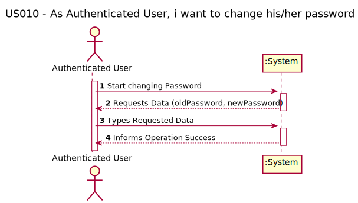
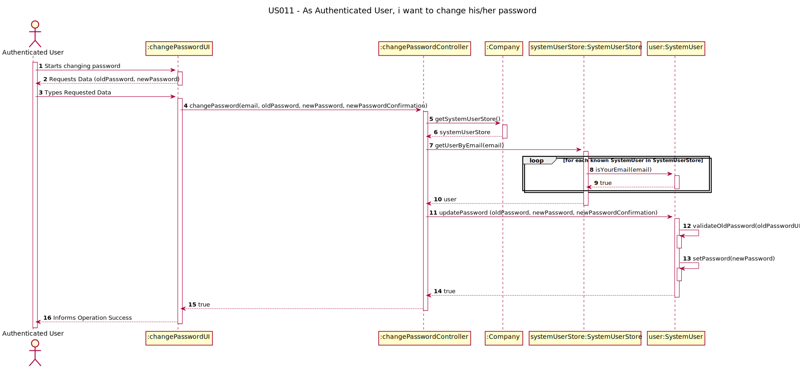
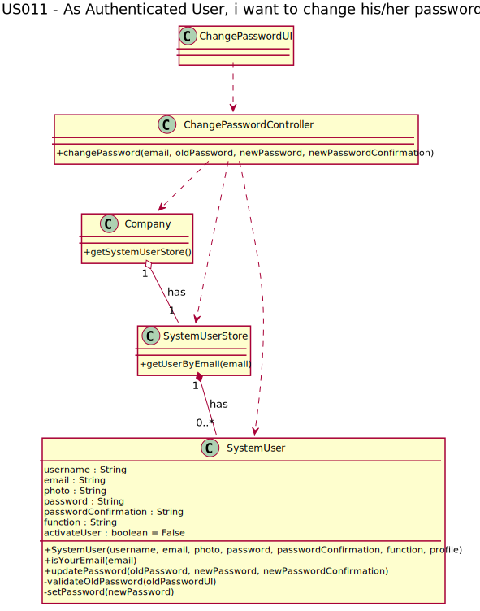

# US 011 - As Authenticated User, I want to change his/her password. 

## 1. Requirements Engineering

To get access to the system a user must enter credentials in the form of email and password.
After successful authentication, the system should create a session that will allow the user to
be identified in subsequent requests.

The system should make it possible to register users through a form accessible via a link in the
login zone. Each user's registration must request at least the following information:

- Name;
- Function;
- E-mail;
- Password;
- Password confirmation;
- Photo (optional).

Creating accounts in the system must ensure that the email address used is unique.

### About the Form

The login form should have a link that allows users to reset their passwords. In this form, the account email 
and a button must be entered. A message will be sent to the mailbox with a link allowing 
the user to securely exchange e-mail.

### About Saving the Password

Passwords should not be openly saved to the database allowing them to be read or decrypted 
by a user with access to the database.

### 1.1. User Story Description

As Authenticated User, I want to change his/her password.

### 1.2. Customer Specifications and Clarifications 

The Authenticated User will change the password.

***Team Ask*** - Can we consider that the passwords are encrypted?

***PO Answer*** - Passwords are stored encrypted.

### 1.3. Acceptance Criteria

- AC001: the password field must not be empty;
- AC002: the username field must have a length higher than 2 characters.

### 1.4. Found out Dependencies

This US have a dependency to this user stories: 

- US001 - As Non-Registered User, I want to register as an application user;
- US002 - As Non-Registered User, I want to activate a just registered user account;
- US010 - As Authenticated User, I want to update its own personal data (e.g. photo, function, ...).

### 1.5 Input and Output Data

- To change password the actor can:
  - **password**: change this field but cannot leave it empty;
  - **password**: change this field but cannot leave it with low length.

### 1.6. System Sequence Diagram (SSD)

## 2. OO Analysis

### 2.1. Relevant Domain Model Excerpt 

## 3. Design - User Story Realization 

### 3.1. Rationale

| Interaction ID | Question: Which class is responsible for... | Answer  | Justification (with patterns)  |
|:-------------  |:--------------------- |:------------|:---------------------------- |
| Step 1  		 |	Ator (Authenticated User) iterate with UI	|ChangePasswordUI|GRASP|
| Step 2  		 |	UI iterate with Controller	|ChangePasswordController|GRASP / HC + LC|
| Step 3  		 |	Change Password  | SystemUserStore | GRASP - Pure Fabrication / HC + LC |

[comment]: <> (| Step 4  		 |							 |             |                              |)

[comment]: <> (| Step 5  		 |							 |             |                              |)

[comment]: <> (| Step 6  		 |							 |             |                              |              )

### Systematization ##

[comment]: <> (According to the taken rationale, the conceptual classes promoted to software classes are: )

[comment]: <> ( * Class1)

[comment]: <> ( * Class2)

[comment]: <> ( * Class3)

## 3.2. Sequence Diagram (SD)

## 3.3. Class Diagram (CD)

# 4. Tests 

We try to think about how we want to test each class and method used in this US,
therefore we have listed the tests below:

###4.1. Controller tests

| Class | Test Goal |
|:-------------  |:--------------------- |
| ChangePasswordController |	Ensure that the methods work with many scenarios to change password|
| ChangePasswordController |	Ensure that store pattern were working|

      changePasswordSuccess() {
      //Arrange
      Company company = new Company();
      SystemUser joana = new SystemUser("Joana", "123@isep.pt",
      "Aluna", "AAA", "AAA", "img_123",
      company.getUserProfileStore().getUserProfile("visitor"));
      ChangePasswordController controllerTest = new ChangePasswordController(company);
      //Act
      company.getSystemUserStore().saveSystemUser(joana);
      //Assert
      assertTrue(controllerTest.changePassword("123@isep.pt", "AAA", "BBB", "BBB"));
      }

###4.1. Model tests

| Class | Test Goal |
|:-------------  |:--------------------- |
| SystemUser |	Validate if the old password is changed by the new password|
| SystemUser |	Validate if the old password, stored in the system user, is equal password that came from the UI|
| SystemUser |	Validate if the new password is encrypted|
| SystemUser |	Validate if the new password isn't encrypted|
| SystemUser |	Validate if the new password is decrypted|
| SystemUser |	Validate if the new password isn't decrypted|

- *Ensure that the password is valid and is stored encrypted:*

        verifyUpdateAndEncryptationOfPassword() {

        //Arrange
        Company company = new Company();
        UserProfile userProfile = company.getUserProfileStore().getUserProfile("Visitor");
        SystemUser joana = new SystemUser("Joana", "112@isep.ipp.pt", "Aluna_10", "HELLO", "HELLO", "png_123", userProfile);
        //Act
        joana.updatePassword("HELLO", "ghi", "ghi");
        //Assert
        assertEquals("ÊËÌ", joana.getPassword());
    }

- *Check if the password, stored in the system, is equal to the password that came from UI:*

        verifyOldPassword() {

        //Arrange
        Company company = new Company();
        UserProfile userProfile = company.getUserProfileStore().getUserProfile("Visitor");
        SystemUser joana = new SystemUser("Joana", "112@isep.ipp.pt", "Aluna_10",
                "HELLO_01", "HELLO_01", "png_123", userProfile);
        //Act
        assertFalse(joana.updatePassword("HELLO_02", "GOODBYE", "GOODBYE"));

    }

# 6. Integration and Demo

Because many of the usage classes were already made and yours business logic were consolidated,
the integration with them was simple. We need to verify some rules and implement others,
but most of our work was devoted to the design and tests.

# 6. Observations

As team, we need to understand how to better perform unitary and integrations tests, and how to integrate all
GRASP, HC+LC and low coupling methods. 
  
