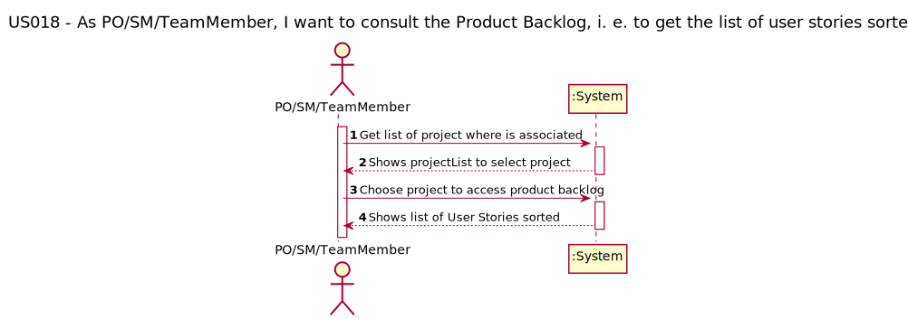
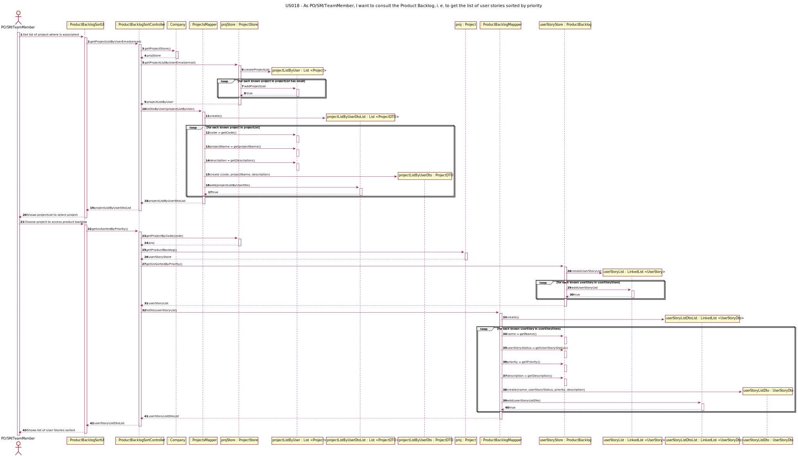
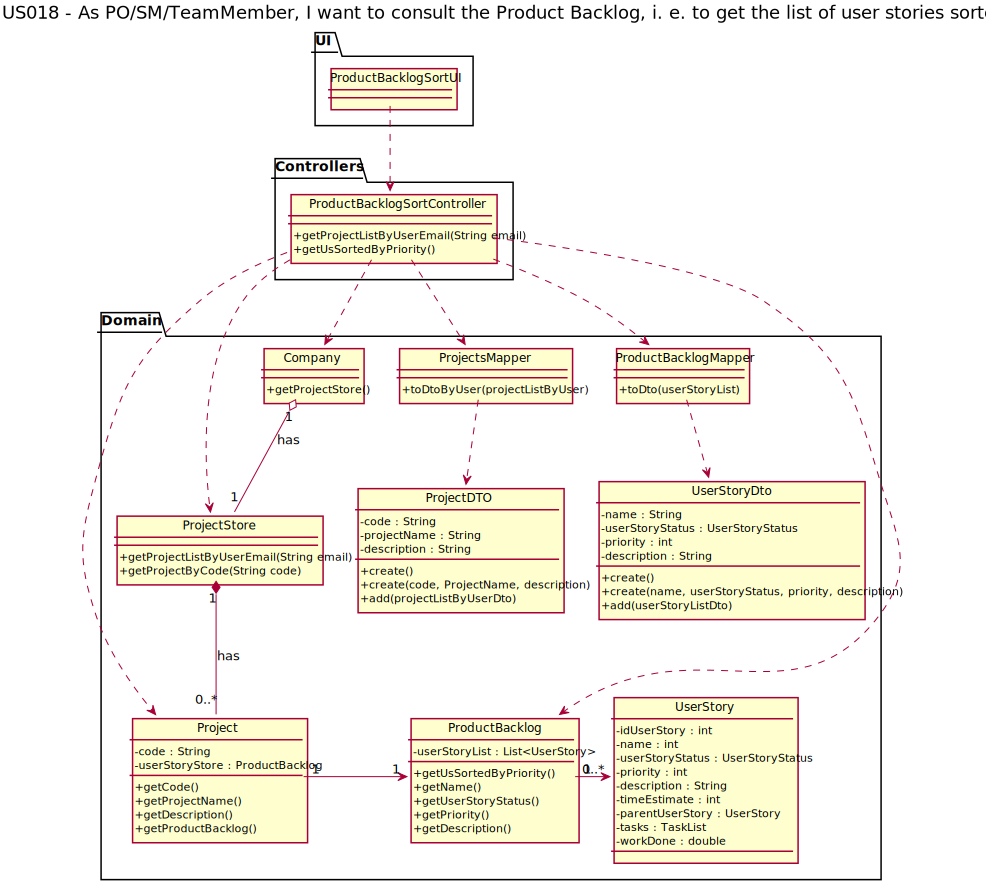

# US 018 - As PO/SM/Team Member, I want to consult the product backlog, i.e. to get the list of user stories sorted by priority

## 1. Requirements Engineering

**Record of activities of a project**

In scrum, the requirements of the project are expressed as user stories and the set of all user stories is the “_project backlog” (known as product backlog too)_. Almost all activities in the project are related to these user
stories. **User stories are created by the Product Owner (PO) and added to the project backlog**.

The project timeline is divided into sprints (multiple of weeks), typically of the predefined duration, and the project team, PO and SM don’t change during the sprint. Each sprint has a “sprint backlog”, i.e. the set of user stories that should be addressed during
the sprint. A user story may include several tasks that have to be done for the user story to be
completed. During the sprint, project team members register work done in these tasks.
During project execution, a user story that is too broad in scope may be further decomposed into several more detailed user stories. This can only be done by the PO on user stories in the product backlog - product backlog grooming.
At the end of the sprint, the unfinished user stories in the sprint backlog and those whose implementation may have been rejected by the PO return to the product backlog.

**The User Story Status Process**

- To do;
- In progress;
- Done;
- Cancelled;
- In test;
- Refined;

      
**The User Story Prioritization Process**

Number Priority defines the priority of a User Story in Backlog. 

One of the commonly used methods is **stacked ranking** — the act of taking your list of items that need prioritisation and ranking them from the most important (top of the stack with number 1) to the least important (bottom of the stack with number 5).

User stories with status different from "cancelled" and "done" are shown at the beginning following the ascending order of priority, then the user stories with no defined priority (equal to 0) are listed. At the end, the user stories with clone and done status are presented.

### 1.1. User Story Description

As PO/SM/Team Member, I want to consult the product backlog, i.e. to get the list of user stories sorted by priority

### 1.2. Customer Specifications and Clarifications 

No clarifications were requested from the client.

### 1.3. Acceptance Criteria

- ACP001: From 1 to 5, with 1 being the highest priority and 5 the lowest priority;
- ACP002: Priorities can be repeated, i.e. there can be multiple user stories with priority 1 but each user story only has one priority;
- ACP003: The list to be presented does not contain all the information regarding the user stories, it only contains (name, user story status, priority, description);
- ACP004: User stories cancelled or done appear at the end of the priority list;

### 1.4. Found out Dependencies

This US have a dependency to this user stories:
- US005 - register/create a new project;
- US009 - Create user story and add it to the product backlog;

### 1.5 Input and Output Data

####Input Data
To get the list of user stories sorted, the actor must choose the project from the list of projects presented and then select product backlog for this project.

####Output Data
This process will be return a list with name of user story, their status, priority and description. List sorted in ascending order.

### 1.6. System Sequence Diagram (SSD)

## 2. OO Analysis

### 2.1. Relevant Domain Model Excerpt 
*In this section, it is suggested to present an excerpt of the domain model that is seen as relevant to fulfill this requirement.* 

## 3. Design - User Story Realization 

### 3.1. Rationale

**The rationale grounds on the SSD interactions and the identified input/output data.**

| Interaction ID | Question: Which class is responsible for...           | Answer                                   | Justification (with patterns)                                                                                                                                 |
|:---------------|:------------------------------------------------------|:-----------------------------------------|:--------------------------------------------------------------------------------------------------------------------------------------------------------------|
| Step 1  		     | 			get the list of user stories sorted by priority				| userStoryListDtoList                     | GRASP - Pure Fabrication / HC + LC                                                                                                                            |
| Step 2  		     | 				Iterate with UI			                                | Controller                               | GRASP - Controller                                                                                                                                            |
| Step 3  		     | 			knowing all projects 	                             | ProjectStore                             | Pure Fabrication / by applying High Cohesion(HC) + Low Coupling (LC) on class Company                                                                         |        
| Step 4  		     | 					knowing all user stories	  | ProductBacklog                           |      Information Expert                                                                                                                                              |
| Step 5  		     | 				Pass data between systems and reduce coupling			  | ProjectDTO and UserStoryDto              | DTO Pattern                                                                                                                                                   |
| Step 6  		     | 						Create and manage DTO  	                        | ProjectsMapper and ProductBacklogMappper | Mapper Pattern |

### Systematization ##

According to the taken rationale, the conceptual classes promoted to software classes are: 

 * Project
 * ProductBacklog
 * UserStory

Other software classes (i.e. Pure Fabrication) identified: 
 * ProductBacklogSortUI  
 * ProductBacklogSortController
 * ProjectsMapper
 * ProjectStore
 * ProjectDTO
 * UserStoryDto
 * ProductBacklogMappper

## 3.2. Sequence Diagram (SD)

## 3.3. Class Diagram (CD)

# 4. Tests 
We try to think about how we want to test each class and method used in this US,
therefore we have listed the tests below:

| Class                        | Test Goal                                                                                                          |
|:-----------------------------|:-------------------------------------------------------------------------------------------------------------------|
| ProductBacklogSortController | 	Ensure that the methods return a list with results - for project                                                  |
| ProductBacklogSortController | 	Ensure that created DTO list contains correct information - for project                                           |
| ProductBacklogSortController | 	get exception message "Email cannot be blank“                                                                     |
| ProductBacklogSortController | 	get exception message  "Email don't exist in system"                                                              |
| ProductBacklogSortController | grants a list of US that is sorted by priority. It keeps the done and/or cancelled US on the end  - for US list    |
| ProductBacklogSortController | 	get exception message "Check priority, cannot be < 0 or superior to 5.“                                           |
| ProductBacklogSortController | grants a list of US that is sorted by priority. It keeps the done and/or cancelled US on the end - for DTO US list |
| ProjectsMapper               | Ensure that the methods return a list with results                                                                 |
| ProjectsMapper               | check if the created DTO list contains correct information                                                         |
| ProjectStore                 | Ensure that the methods return a list with results                                                                 |
| ProjectStore                 | get exception message "Email cannot be blank“                                                                      |
| ProjectStore                 | get exception message  "Email don't exist in system"                                                               |
| ProjectStore                 | check if the provided project is correct                                                                           |
| ProjectStore                 | return null when project code does not exist                                                                       |
| Project                      | validate that list have results (not null) and check list size are correct - get userStoryStore                    |
| Project                      | get name, projectName, description                                                                                 |
| ProductBacklog               | grants a list of US that is sorted by priority. It keeps the done and/or cancelled US on the end                   |
| ProductBacklog               | Ensure that the methods return a list with results                                                                 |
| ProductBacklog               | get exception message "Check priority, cannot be < 0 or superior to 5.“                                            |
| ProductBacklog               | get name, userStoryStatus, description, priority                                                                   |

        getSortedListWithSuccessCorrectDTOInfo(){
        Company company = new Company();
        ProjectsMapper mapper = new ProjectsMapper();
        ProductBacklogMapper mapperPB = new ProductBacklogMapper();
        Typology typo = company.getTypologyStore().getTypology("Fixed Cost");
        Customer customer = company.getCustomerStore().getCustomerByName("Teste");
        BusinessSector sector = company.getBusinessSectorStore().getBusinessSectorByDescription("sector");
        Project project = company.getProjectStore().createProject( "prototype", "test56", customer,
        typo, sector, LocalDate.now(), 7, 5000);
        Project project2 = company.getProjectStore().createProject( "prototype", "test56", customer,
        typo, sector, LocalDate.now(), 7, 5000);
        UserProfile userProfile = company.getUserProfileStore().getUserProfile("Visitor");
        SystemUser newUser = new SystemUser("xyz", "cris@ipp.pt", "des", "gth", "gth", "", userProfile);
        LocalDate startDate = LocalDate.of(2021, 12, 31);
        LocalDate endDate = LocalDate.of(2022, 1, 5);
        Resource input = new Resource(newUser, startDate, endDate, 100, .5);
        ProjectTeam projectTeam = new ProjectTeam();// Arrange

        company.getProjectStore().saveNewProject(project);
        UserStory userStory =project.getUserStoryStore().createUserStory("US001",2,"create user story",5);
        project.getUserStoryStore().saveUserStory(userStory);
        UserStory userStory1 =project.getUserStoryStore().createUserStory("US001",1,"sort user story",5);
        project.getUserStoryStore().saveUserStory(userStory1);
        UserStory userStory2 =project.getUserStoryStore().createUserStory("US001",3,"backlog sorted",5);
        project.getUserStoryStore().saveUserStory(userStory2);
        UserStory userStory3 =project.getUserStoryStore().createUserStory("US001",5,"show sorted",5);
        project.getUserStoryStore().saveUserStory(userStory3);

        projectTeam.saveResource(input);
        project.setProjectTeam(projectTeam);

        // Act
        ProductBacklogSortController productBacklogSortController = new ProductBacklogSortController(company, mapper, mapperPB);
        productBacklogSortController.getProjectListByUserEmail("cris@ipp.pt");
        List<UserStoryDto> userStoryListDtoList = productBacklogSortController.getUsSortedByPriority("Project_2022_1");

        // Assert

        assertEquals(userStory.getName(),userStoryListDtoList.get(1).getName());
        assertEquals(userStory.getUserStoryStatus(),userStoryListDtoList.get(1).getUserStoryStatus());
      assertEquals(userStory.getPriority(),userStoryListDtoList.get(1).getPriority());
        assertEquals(userStory.getDescription(),userStoryListDtoList.get(1).getDescription());
        assertEquals(userStory1.getName(),userStoryListDtoList.get(0).getName());
        assertEquals(userStory1.getUserStoryStatus(),userStoryListDtoList.get(0).getUserStoryStatus());
        assertEquals(userStory1.getPriority(),userStoryListDtoList.get(0).getPriority());
        assertEquals(userStory1.getDescription(),userStoryListDtoList.get(0).getDescription());
        assertEquals(userStory2.getName(),userStoryListDtoList.get(2).getName());
        assertEquals(userStory2.getUserStoryStatus(),userStoryListDtoList.get(2).getUserStoryStatus());
        assertEquals(userStory2.getPriority(),userStoryListDtoList.get(2).getPriority());
        assertEquals(userStory2.getDescription(),userStoryListDtoList.get(2).getDescription());
        assertEquals(userStory3.getName(),userStoryListDtoList.get(3).getName());
        assertEquals(userStory3.getUserStoryStatus(),userStoryListDtoList.get(3).getUserStoryStatus());
        assertEquals(userStory3.getPriority(),userStoryListDtoList.get(3).getPriority());
        assertEquals(userStory3.getDescription(),userStoryListDtoList.get(3).getDescription());
    }
}

