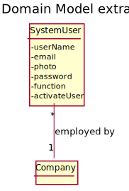
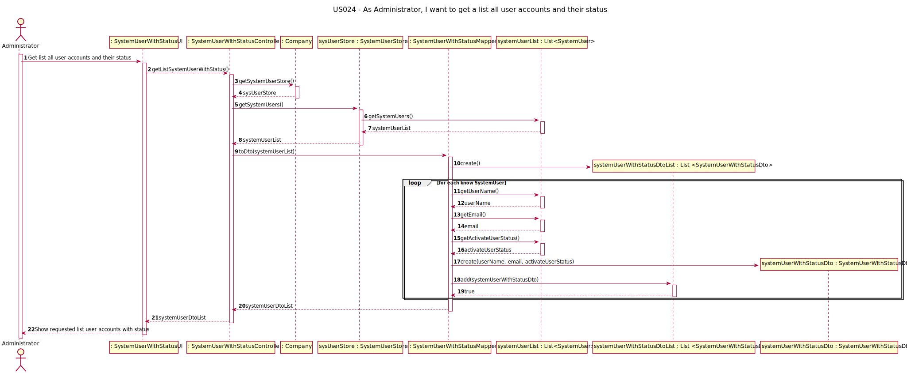
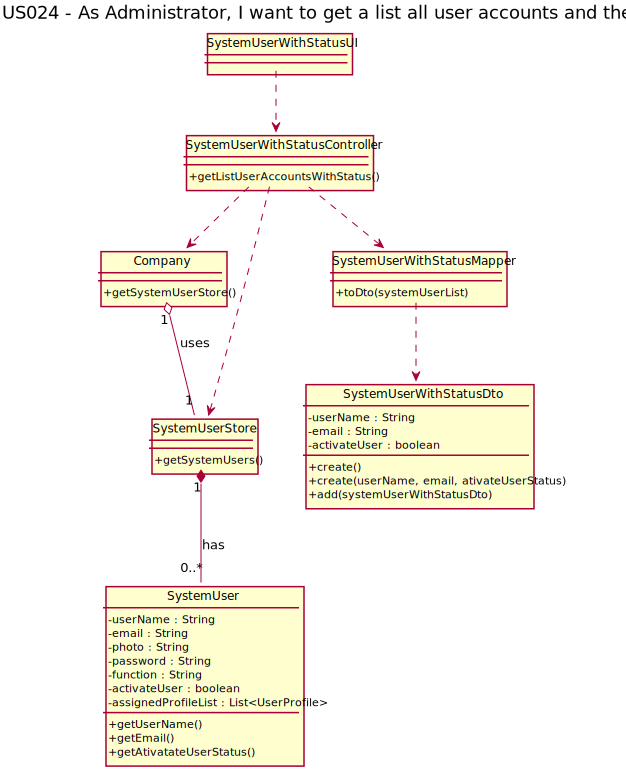

# US 024 - As Administrator, I want to get a list all user accounts and their status

## 1. Requirements Engineering

In order to build a project management solution for this company, it's necessary including an administration area its resources in functionalities that should cover the following aspects:
Administration - manage user accounts and associate the profiles available to solution administrators, manage resources and general configuration;

***Register with the system*** - The system should make it possible to register users through a form accessible via a link in the login zone. Each user's registration must request at least the following information:
- Name;
- Function;
- E-mail;
- Password;
- Password confirmation;
- Photo (optional);

Creating accounts in the system must ensure that the email address used is unique.

***User Management*** - The system should have an administration area, which allows the system administrator to
perform the following activities:
- List all system users;
- Search for users with availability of at least the following fields:
  - E-mail;
  - Profile.
- Associate user accounts with existing profiles;
- Activate and inactivate user accounts;
- Edit other user account information.

### 1.1. User Story Description

As Administrator, I want to get a list all user accounts and their status

### 1.2. Customer Specifications and Clarifications 

***Team Ask*** - The list that we want to return, should it only contain the identifying element of the user (email) and its status (active/inactive)?

***PO Answer*** - As nothing will be shown yet (we don't have UI), we don't know exactly what is needed. Email and status looks fine to me. Later on, you may need more stuff...

### 1.3. Acceptance Criteria

- ACP001: The email address used is unique;
- ACP002: Exist two types of status - (active or inactive) represented by a boolean attribute named activateUser;

We consider the following interpretations:
- In addition to the data mentioned above (email and status) we consider important to include the username.

### 1.4. Found out Dependencies

This US have a dependency to this user stories:
- US001 - Register a user;
- US002 - Activate user account;
- US004 - Search for users;
- US025 - Inactivate a user account;
- US026 - Activate a user account;

### 1.5 Input and Output Data

####Input Data
To get the list of user accounts with status, the actor must choose the option to get the list of user accounts with their status.

####Output Data
This process will be return a list with username, email and their status, as requested.

### 1.6. System Sequence Diagram (SSD)

[//]: # (![US024-SSD]&#40;US024-SSD.svg&#41;)
[//]: # ()

## 2. OO Analysis

### 2.1. Relevant Domain Model Excerpt 

## 3. Design - User Story Realization 

### 3.1. Rationale

**The rationale grounds on the SSD interactions and the identified input/output data.**

| Interaction ID | Question: Which class is responsible for...               | Answer                                                                            | Justification (with patterns)  |
|:---------------|:----------------------------------------------------------|:----------------------------------------------------------------------------------|:---------------------------- |
| Step 1  		     | 			get a list with all user accounts and their status				 | SystemUserList                                                                    |       GRASP - Pure Fabrication / HC + LC                       |
| Step 2  		     | 	Iterate with UI						                                                   | Controller                                                                        |     GRASP - Controller                         |
| Step 3  		     | 		How to pass data between systems and reduce coupling					                                                   | Create systemUserWithStatusDTO                                                    |                DTO Pattern              |
| Step 4  		     | 		How to create and manage DTO| 					                                                  systemUserWithStatusMapper |          Mapper Pattern                    |                    |                                                                                   |                              |              

### Systematization ##

According to the taken rationale, the conceptual classes promoted to software classes are: 

 * SystemUser
 * SystemUserStore

Other software classes (i.e. Pure Fabrication) identified: 
 * SystemUserWithStatusUI  
 * SystemUserWithStatusController
 * SystemUserWithStatusMapper
 * SystemUserWithStatusDto

## 3.2. Sequence Diagram (SD)

*In this section, it is suggested to present an UML dynamic view stating the sequence of domain related software objects' interactions that allows to fulfill the requirement.* 

## 3.3. Class Diagram (CD)

*In this section, it is suggested to present an UML static view representing the main domain related software classes that are involved in fulfilling the requirement as well as and their relations, attributes and methods.*

# 4. Tests 
We try to think about how we want to test each class and method used in this US,
therefore we have listed the tests below:

| Class                          | Test Goal                                                  |
|:-------------------------------|:-----------------------------------------------------------|
| SystemUserWithStatusController | 	Ensure that the methods return a list with results        |
| SystemUserWithStatusController    | 	Ensure that the methods return an empty list              |
| SystemUserWithStatusController      | 	Ensure that created DTO list contains correct information |
| SystemUserWithStatusController     | 	Ensure that Mapper and DTO pattern were working           |

        getListSystemUserWithStatusSuccess() {
        //Arrange
        Company company = new Company();
        SystemUserWithStatusMapper mapper = new SystemUserWithStatusMapper();
        SystemUserWithStatusController systemUserWithStatusController = new SystemUserWithStatusController(company, mapper);

        String userName = "manueloliveira";
        String email = "manueloliveira@beaver.com";
        String password = "ghi";
        String passwordConfirmation = "ghi";
        String function = "tester";
        String photo = "photo";
        UserProfile profile = company.getUserProfileStore().getUserProfile("Visitor");

        List<UserProfile> assignedProfileExpected = new ArrayList<>();
        assignedProfileExpected.add(profile);

        SystemUser newUser = company.getSystemUserStore().createSystemUser(userName, email, function, password,
                passwordConfirmation, photo, profile);
        newUser.setActivateUser();
        company.getSystemUserStore().saveSystemUser(newUser);
        SystemUser newUser2 = company.getSystemUserStore().createSystemUser("Cris", "Cris@ipp.pt",
                function, password, passwordConfirmation, photo, profile);
        newUser2.setActivateUser();
        company.getSystemUserStore().saveSystemUser(newUser2);

        // Act
        List<SystemUserWithStatusDto> systemUserWithStatusDto = systemUserWithStatusController.getListSystemUserWithStatus();

        // Assert
        assertEquals(newUser.getUserName(), systemUserWithStatusDto.get(0).getUserName());
        assertEquals(newUser.getEmail(), systemUserWithStatusDto.get(0).getEmail());
        assertEquals(newUser.isActivateUser(), systemUserWithStatusDto.get(0).isActivateUser());
        assertEquals(newUser2.getUserName(), systemUserWithStatusDto.get(1).getUserName());
        assertEquals(newUser2.getEmail(), systemUserWithStatusDto.get(1).getEmail());
        assertEquals(newUser2.isActivateUser(), systemUserWithStatusDto.get(1).isActivateUser());
    }

# 5. Construction (Implementation)

*In this section, it is suggested to provide, if necessary, some evidence that the construction/implementation is in accordance with the previously carried out design. Furthermore, it is recommeded to mention/describe the existence of other relevant (e.g. configuration) files and highlight relevant commits.*

*It is also recommended to organize this content by subsections.* 

# 6. Integration and Demo 

Because many of the usage classes were already made and yours business logic were consolidated,
the integration with them was simple. We need to verify some rules and implement others,
but most of our work was devoted to the design and tests.

# 7. Observations

As team, we need to better understand how to think about and define the tests that will be performed.

