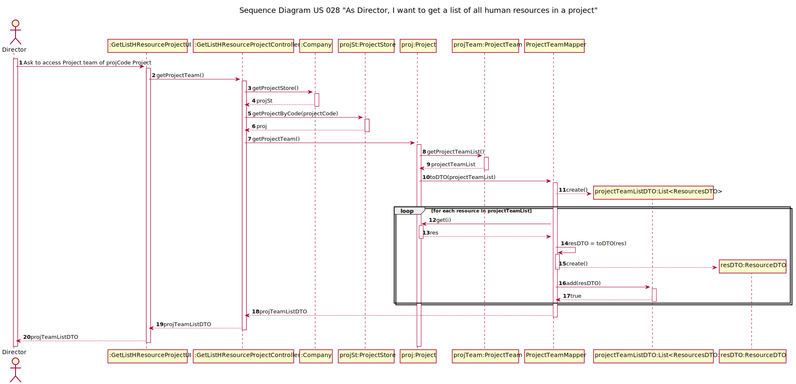

# US025 - As Administrator, I want to inactivate a user account

## 1. Requirements Engineering

The project management access requires a register. After that, it is necessary an activation.
As Administrator manage user accounts, in this US appears the possibility to inactive the user account.

### 1.1. User Story Description

*"As Admnistrator, I want to inactivate a user account"*

### 1.2. Customer Specifications and Clarifications 

PERGUNTA(G4, 30/01): 
Um utilizador que esteja numa Lista de recursos de um/vários projetos poderá ter a conta desativada?

RESPOSTA: 
PO Sim. Sem qualquer outra implicação no sistema. (AMM, 31/01)

### 1.3. Acceptance Criteria
The user must exist in the system user

### 1.4. Found out Dependencies

This US depends on US024 - As Administrator, I want to get a list all user accounts and their status. 

### 1.5 Input and Output Data

The actor makes the request to inactivate the account (input) and receives the confirmation (output).

### 1.6. System Sequence Diagram (SSD)

### 1.7 Other Relevant Remarks

## 2. OO Analysis

### 2.1. Relevant Domain Model Excerpt 

[comment]: <> (![USXX-MD]&#40;US028-MD.svg&#41;)

### 2.2. Other Remarks

## 3. Design - User Story Realization 

### 3.1. Rationale

**The rationale grounds on the SSD interactions and the identified input/output data.**

| Interaction ID | Question: Which class is responsible for... | Answer  | Justification (with patterns)  |
|:-------------  |:--------------------- |:------------|:---------------------------- |
| Step 1  		 |			InnactiveUser 				 |       System User    |                              |
| Step 2  		 |					Interate with UI 		 |       Controller       |                              |
| 	

### Systematization ##

According to the taken rationale, the conceptual classes promoted to software classes are: 

 * System User 

Other software classes (i.e. Pure Fabrication) identified: 
 * InnactivateUserAccountUI
 * InnactivateUserAccountController

## 3.2. Sequence Diagram (SD)

## 3.3. Class Diagram (CD)

# 4. Tests 
The tests were developed in order to understand if the user, already in the system, can be inactive.

**Test 1:** Check that it is possible to inactivate the user

  

