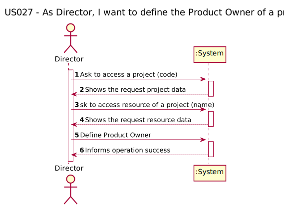
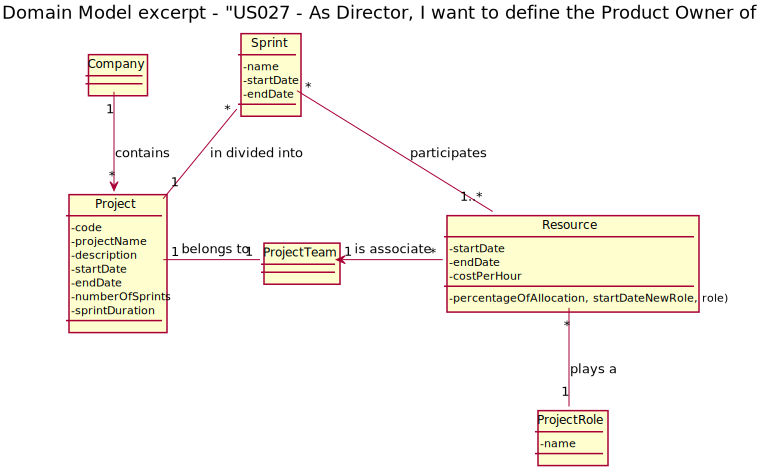
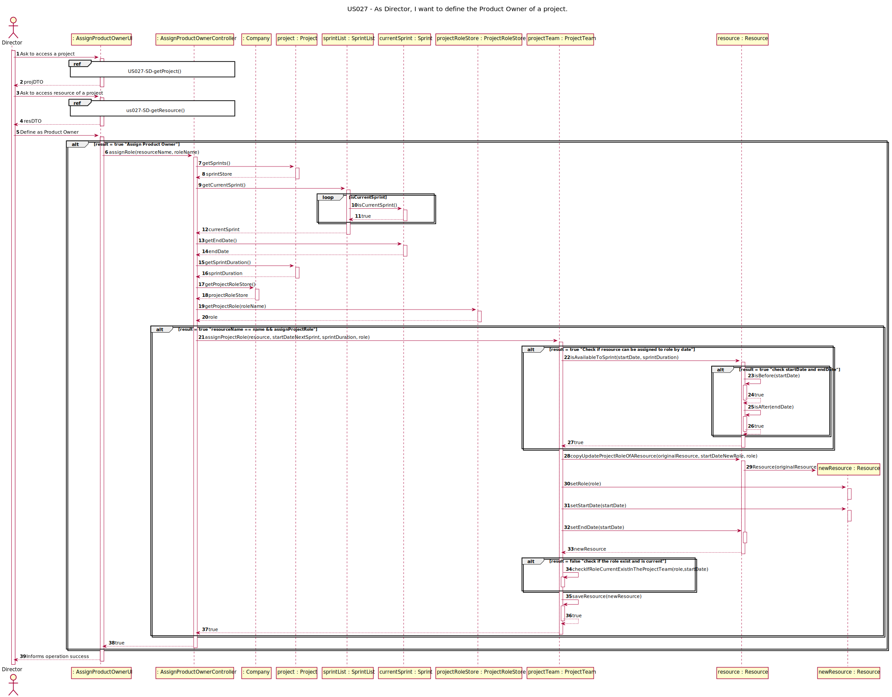
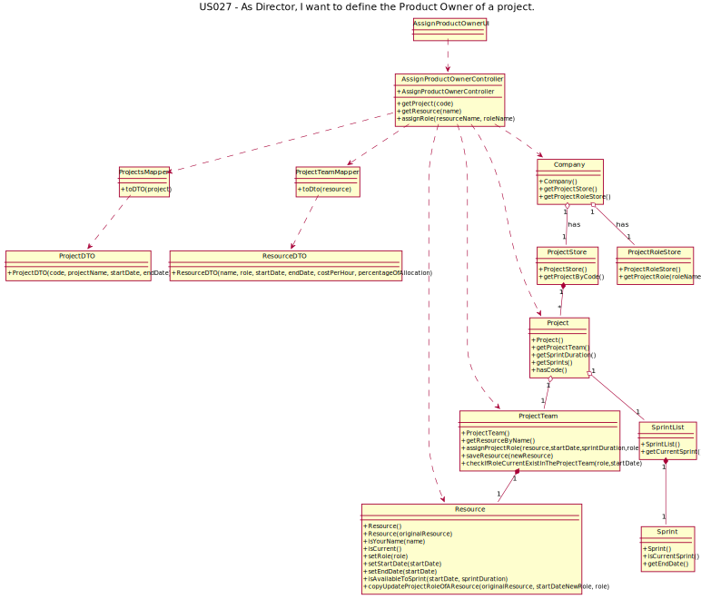

# US 027 - As Director, I want to define the Product Owner of a project.

## 1. Requirements Engineering

  The Project Manager, Product Owner and Scrum Master profiles are special profiles, since they
  are not fixed profiles assigned to particular users, but the result of the roles the users have in a
  particular project over a certain period. For example, when creating a project on the system, a
  user is defined as the manager of that project, making that user project manager, remaining a
  "regular" user in the other projects to which is assigned.
  
  The special profiles is interpreted as role and the roles are associate to resources which is allocated to a project.
  However, as resource is defined the start and end date in the project. 
  Therefore, once the resource is associate in the project is defined the role as null
  and the start and end date as the period which the resource will work in the project.
  The first role is null because the resource can be associate in the project without start and end date defined,
  it is possible just to be available to the project.
  
  Once the resource are working in the project, the role is changed to **Team Member** 
  and that implies to copy the resource object and update the end date of the old resource object to the moment required,
  the new resource object must be updated the role for **Team Member** 
  and the start date must be updated for the moment required plus one day.
  
  This process will be use for all alterations of roles for all resources associated in a project.
  Also, this process can be use for update of any role which exist in the system.

### 1.1. User Story Description

  As Director, I want to define the Product Owner of a project.

### 1.2. Customer Specifications and Clarifications

Director will update the role of a resource.

  ***Team Ask*** - To define the SM of a project, do we already have to allocate another team member, assigned to the project, to the role of SM, or should we allocate a new user to the project with the role of SM?
  
  ***PO Answer*** - It can be as a role´s update.
  
  ***Team Ask*** - Does the Director assign the SM before there are sprints on the project? If so, should the director be able to change the SM after the sprints have started or should it just be the PM?
  
  ***PO Answer*** - The statement refers the sprint team is not supposed to change after the sprint started.

### 1.3. Acceptance Criteria

  - AC001: It needs to return a boolean expression;

### 1.4. Found out Dependencies

This US have a dependency to this user stories:
  - US001 - Register a user;
  - US002 - Activate user account;
  - US005 - Create a project;
  - US007 - Associate user to a project;

### 1.5 Input and Output Data

####Input Data
- To define the project role must fill some parameters:

   - **Project Code**: project where will be updated the resource at the next sprint;
   - **Resource Name**: resource which will be defined as the required role;
   - **Project Role Name**: role which will be assigned to a resource.

#####Output Data

   - This process will be only a return message with the state of update data. In other words, success or fail.
   
### 1.6. System Sequence Diagram (SSD)

## 2. OO Analysis

### 2.1. Relevant Domain Model Excerpt

## 3. Design - User Story Realization

### 3.1. Rationale

**The rationale grounds on the SSD interactions and the identified input/output data.**

| Interaction ID | Question: Which class is responsible for... | Answer  | Justification (with patterns)  |
|:-------------  |:--------------------- |:------------|:---------------------------- |
| Step 1  		 | Actor (Director) iterate with UI | AssignProductOwnerUI | GRASP - Controller |
| Step 2  		 | How to create and manage DTO | ProjectMapper | Mapper Pattern |
| Step 3  		 | How to pass data between systems and reduce coupling	| Create ProjectDTO | DTO Pattern |
| Step 4  		 | How to create and manage DTO | ProjectTeamMapper | Mapper Pattern |
| Step 5  		 | How to pass data between systems and reduce coupling | Create ResourceDTO | DTO Pattern |

### Systematization ##

According to the taken rationale, the conceptual classes promoted to software classes are:

* Company
* Project
* ProjectRole
* ProjectTeam
* Resource
* Sprint

Other software classes (i.e. Pure Fabrication) identified:
* AssignProductOwnerUI
* AssignProductOwnerController
* ProjectStore
* ProjectsMapper
* ProjectDTO
* ProjectTeam
* ProjectTeamMapper
* ResourceDTO
* ProjectRoleStore
* SprintList

## 3.2. Sequence Diagram (SD)

.svg)
.svg)

## 3.3. Class Diagram (CD)

# 4. Tests
*In this section, it is suggested to systematize how the tests were designed to allow a correct measurement of requirements fulfilling.*

**_DO NOT COPY ALL DEVELOPED TESTS HERE_**

**Test 1:** Check that it is not possible to create an instance of the Example class with empty values.

    class ExampleFixture : public ::testing::Test {
        TEST_F(ExampleFixture, CreateWithEmptyCode){
            EXPECT_THROW(new Example(L"",L"Example One"),std::invalid_argument);
        }
    }

*It is also recommended organizing this content by subsections.*

# 6. Integration and Demo

Because many of the usage classes were already made and yours business logic were consolidated,
the integration with them was simple. We need to verify some rules and implement others,
but most of our work was devoted to the design and tests.

# 6. Observations

As team, we need to understand how to better perform unitary and integrations tests, 
and to work in past user stories in order to organize them.

