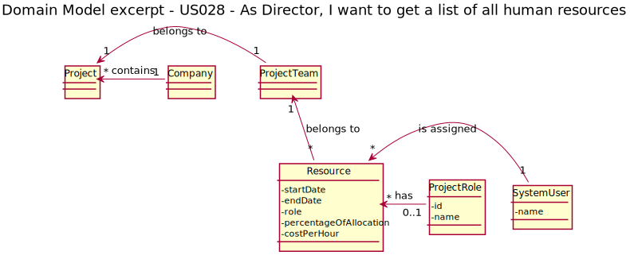

# US 028 - As Director, I want to get a list of all human resources in a project

## 1. Requirements Engineering

Director has access to all projects in the system. Each project has one project team where there are a list of all human resources associated with that project (actual, previous and future).
The human resources associated with the project is saved in the class named Project Team.

The Resources associated to a project must have the following information: 
- Start date;
- End date;
- Cost per hour (monetary value that the resource costs for each hour used in the
project);
- Percentage of allocation (100% for full-time, or the percentage corresponding to part-time);

The system should ensure that at no time (i.e. week) is a resource associated with an allocation
of more than 100% in different projects. You should also ensure that a resource is not
associated with project activities that go out of the allocation time they have set.

These Resources can be added to a project without a role but while performing tasks must be assigned to a role in the project team (i.g. Project Manager, Product Owner, Scrum Master and Team Member). Each Project Team only have one PO, PM and SM at a time. 

The project team is a list that save all resources with their role at a given time.

### 1.1. User Story Description

As Director, I want to get a list of all human resources in a project.

### 1.2. Customer Specifications and Clarifications 

Director will receive a list of all human resources associated to that project.
***Team Ask*** - Do Director want see all active resources or all resources that already worked in the Project?
***PO Answer*** - Everyone assigned to the project.

We consider that Director wants to check all human resources that were, are and will be assigned to the Project.

Each time a resource is assigned to a new role the end date of the role he had before is changed and a new resource is created.

### 1.3. Acceptance Criteria

- AC001: ;
- AC002: ;
- AC003: ;
### 1.4. Found out Dependencies

This US have a dependency to this user stories: 
- US001 - Register a user; 
- US002 - Activate user account; 
- US005 - Create a project; 
- US007 - Associate user to a project; 
- US014 - Define SM of a project;
- US027 - Define PO of a project;

### 1.5 Input and Output Data

**Input Data**

**Project Code**: project where to check the human resources associated

**Output Data**
List of resources associated to the project:
- name of human resource;
- start date;
- end date;
- role;
- cost per hour;
- percentage of allocation.

### 1.6. System Sequence Diagram (SSD)

### 1.7 Other Relevant Remarks

## 2. OO Analysis

### 2.1. Relevant Domain Model Excerpt 

### 2.2. Other Remarks

*Use this section to capture some aditional notes/remarks that must be taken into consideration into the design activity. In some case, it might be usefull to add other analysis artifacts (e.g. activity or state diagrams).* 

## 3. Design - User Story Realization 

### 3.1. Rationale

| Interaction ID | Question: Which class is responsible for... | Answer  | Justification (with patterns)  |
|:-------------  |:--------------------- |:------------|:---------------------------- |
| Step 1  		 |	Iterate with UI	|Controller|GRASP - Controller|
| Step 2  		 |	Pass data between systems | ResourceDto | DTO Pattern |
| Step 3  		 |	Create and manage DTO |  ProjectTeamMapper |  Mapper Pattern                            |

[comment]: <> (| Step 4  		 |							 |             |                              |)

[comment]: <> (| Step 5  		 |							 |             |                              |)

[comment]: <> (| Step 6  		 |							 |             |                              |              )

### Systematization ##

[comment]: <> (According to the taken rationale, the conceptual classes promoted to software classes are: )

[comment]: <> ( * Class1)

[comment]: <> ( * Class2)

[comment]: <> ( * Class3)

Other software classes (i.e. Pure Fabrication) identified: 
 * GetHResourceProjectUI  
 * GetHResourceProjectController
 * ResourceDTO
 * ProjectTeamMapper
## 3.2. Sequence Diagram (SD)

## 3.3. Class Diagram (CD)

# 4. Tests 
*In this section, it is suggested to systematize how the tests were designed to allow a correct measurement of requirements fulfilling.* 

**_DO NOT COPY ALL DEVELOPED TESTS HERE_**

**Test 1:** Check that it is not possible to create an instance of the Example class with empty values. 

    class ExampleFixture : public ::testing::Test {
        TEST_F(ExampleFixture, CreateWithEmptyCode){
            EXPECT_THROW(new Example(L"",L"Example One"),std::invalid_argument);
        }
    }
	

*It is also recommended organizing this content by subsections.* 

# 5. Construction (Implementation)

*In this section, it is suggested to provide, if necessary, some evidence that the construction/implementation is in accordance with the previously carried out design. Furthermore, it is recommeded to mention/describe the existence of other relevant (e.g. configuration) files and highlight relevant commits.*

*It is also recommended to organize this content by subsections.* 

# 6. Integration and Demo 

*In this section, it is suggested to describe the efforts made to integrate this functionality with the other features of the system.*

# 7. Observations

*In this section, it is suggested to present a critical perspective on the developed work, pointing, for example, to other alternatives and or future related work.*

