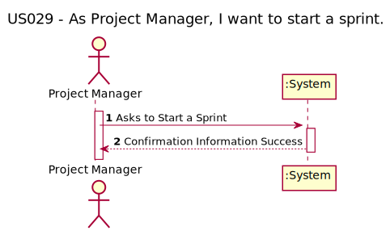
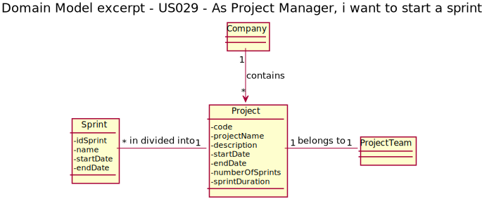
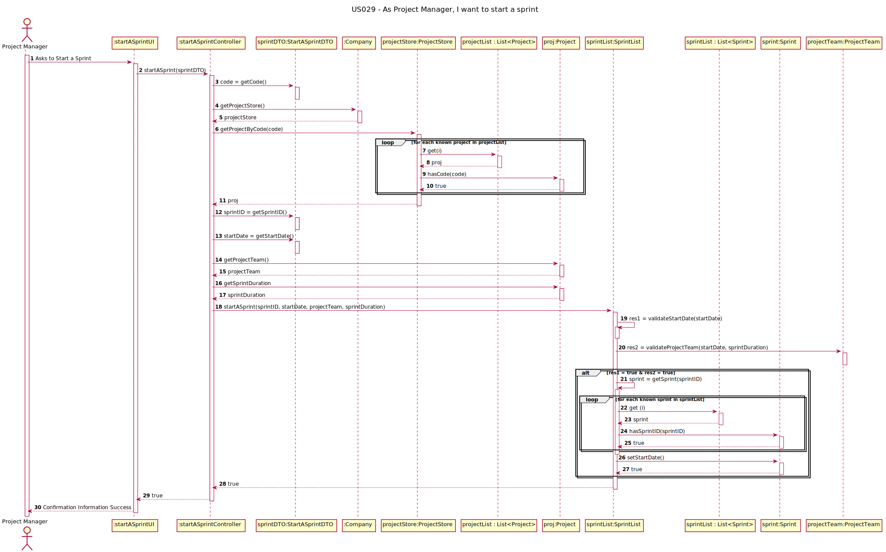
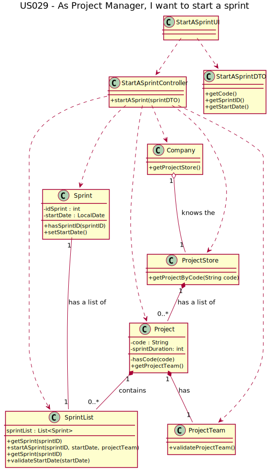

# US 029 - As Project Manager, I want to start a sprint

## 1. Requirements Engineering

In **scrum**, the requirements of the project are expressed as **user stories** and the set of all them is the 
**“project backlog”**. Almost all activities in the project are related to these user stories. User stories 
are **created by the Product Owner (PO)** and **added to the project backlog**.

The **project timeline** is divided into **sprints (multiple of weeks)**, typically of the predefined
2 duration, and the **project team, PO and Scrum Master (SM)** **_don’t change during the sprint_**.

### 1.1. User Story Description
x
As Project Manager, I want to start a sprint

### 1.2. Customer Specifications and Clarifications 

The Project Manager will start the sprint.

***Team Ask*** - What does starting a sprint entail?

***PO Answer*** - The team can start working.

***Team Ask*** - What can we consider "Start a Sprint"?

***PO Answer*** - The sprint goes into the state of started on the date defined by the PM. As for the rest, user stories about Sprint Planning, etc., are not yet defined.

***Team Ask*** - Can the PM start the Sprint earlier than the previously planned date? And start later?

***PO Answer*** - Yes, it can.

***Team Ask*** - If it can be started later than the planned date, can it be started in the period of a later Sprint?

***PO Answer*** - Sure. There can only be one active sprint at any given time, that is, there are no overlapping sprints. I remember that sprints have a sequential numbering.

***Team Ask*** - Can a planned Sprint not start?

***PO Answer*** - Sure. It may mean that the project ended (successfully or cancelled) before running the sprint.

### 1.3. Acceptance Criteria

- AC001: the sprint must have a validate start date to start;
- AC002: the start date of the sprint cannot be contained in the sprint duration;
- AC003: the sprint must have a validated team to start organizing the sprint work;
- AC004: the sprint must have a validated PO and SM to start organizing the sprint work.

### 1.4. Found out Dependencies

This US have a dependency to this user stories: 
 
- US008 - Edit some project information; 
- US016 - View status of activities in a project;
- US022 - Create a sprint.

### 1.5 Input and Output Data

- To start sprint the actor must validate some parameters:
    - **start date**: the start date needs to be before the end date of the last sprint and, if necessary, can be a "pause" between sprints;
    - **project team** the actual project team must have at least a PO and a SM available to that sprint date and during the sprint duration.
    - 
- If those validations were true:
    - **id sprint**: the sprint ID will be validated;
    - **start date**: the sprint will start with the current system date.

### 1.6. System Sequence Diagram (SSD)

## 2. OO Analysis

### 2.1. Relevant Domain Model Excerpt 

## 3. Design - User Story Realization 

### 3.1. Rationale

| Interaction ID | Question: Which class is responsible for... | Answer  | Justification (with patterns)  |
|:-------------  |:--------------------- |:------------|:---------------------------- |
| Step 1  		 |	Ator (Project Manager) iterate with UI	|StartASprintUI|GRASP - Controller|
| Step 2  		 |	Pass data between systems and to reduce coupling | StartASprintDTO | DTO Pattern |

[comment]: <> (| Step 4  		 |							 |             |                              |)

[comment]: <> (| Step 5  		 |							 |             |                              |)

[comment]: <> (| Step 6  		 |							 |             |                              |              )

### Systematization ##

[comment]: <> (According to the taken rationale, the conceptual classes promoted to software classes are: )

[comment]: <> ( * Class1)

[comment]: <> ( * Class2)

[comment]: <> ( * Class3)

Other software classes (i.e. Pure Fabrication) identified: 
 * StartASprintUI  
 * StarASprintController
 * StarASprintDTO
 * ProjectStore
 * SprintList

## 3.2. Sequence Diagram (SD)

## 3.3. Class Diagram (CD)

# 4. Tests 

We try to think about how we want to test each class and method used in this US,
therefore we have listed the tests below:

###4.1. Controller tests

| Class | Test Goal |
|:-------------  |:--------------------- |
| StartASprintController |	Ensure that the methods work with many scenarios to start a sprint|
| StartASprintController |	Ensure that DTO pattern (StartASprintDTO) were working|

        startASprintGlobalSuccess() {
        //Arrange
        Company company = new Company();
        StartASprintController startASprintController = new StartASprintController(company);
        Typology typo = company.getTypologyStore().getTypology("Fixed Cost");
        Customer customer = company.getCustomerStore().getCustomerByName("isep");
        BusinessSector sector = company.getBusinessSectorStore().getBusinessSectorByDescription("it");
        
        //Project
        Project proj1 = company.getProjectStore().createProject("prototype1", "proj1Prototype", customer,
                typo, sector, LocalDate.of(2022, 1, 1), 2, 3000);
        proj1.setEndDate(LocalDate.of(2022, 12, 31));
        company.getProjectStore().saveNewProject(proj1);
        UserProfile profile = company.getUserProfileStore().getUserProfile("Visitor");

        //Resource 1
        SystemUser joana1 = new SystemUser("joana1", "joana1@beaver.com", "tester", "ghi", "ghi", "photo", profile);
        LocalDate startDatej1 = LocalDate.of(2022, 1, 1);
        LocalDate endDatej1 = LocalDate.of(2022, 1, 30);
        Resource joana1R = proj1.createResource(joana1, startDatej1, endDatej1, 100, .5);
        joana1R.setRole(company.getProjectRoleStore().getProjectRole("Scrum Master"));
        proj1.getProjectTeam().saveResource(joana1R);

        //Resource 2
        SystemUser joana2 = new SystemUser("joana2", "joana2@beaver.com", "tester", "ghi", "ghi", "photo", profile);
        LocalDate startDatej2 = LocalDate.of(2022, 1, 1);
        LocalDate endDatej2 = LocalDate.of(2022, 1, 30);
        Resource joana2R = proj1.createResource(joana2, startDatej2, endDatej2, 100, 1);
        joana2R.setRole(company.getProjectRoleStore().getProjectRole("Product Owner"));
        proj1.getProjectTeam().saveResource(joana2R);

        //Resource 3
        SystemUser joana3 = new SystemUser("joana3", "joana3@beaver.com", "tester", "ghi", "ghi", "photo", profile);
        LocalDate startDatej3 = LocalDate.of(2022, 1, 1);
        LocalDate endDatej3 = LocalDate.of(2022, 12, 31);
        Resource joana3R = proj1.createResource(joana3, startDatej3, endDatej3, 100, .5);
        joana3R.setRole(company.getProjectRoleStore().getProjectRole("Project Manager"));
        proj1.getProjectTeam().saveResource(joana3R);

        //Resource 4
        SystemUser joana4 = new SystemUser("joana4", "joana4@beaver.com", "tester", "ghi", "ghi", "photo", profile);
        LocalDate startDatej4 = LocalDate.of(2022, 1, 1);
        LocalDate endDatej4 = LocalDate.of(2022, 12, 31);
        Resource joana4R = proj1.createResource(joana4, startDatej4, endDatej4, 100, .3333);
        joana4R.setRole(company.getProjectRoleStore().getProjectRole("Team Member"));
        proj1.getProjectTeam().saveResource(joana4R);

        //Create a Sprint
        proj1.getSprints().saveSprint(proj1.getSprints().createSprint("Sprint_1", LocalDate.of(2022, 1, 1),
                proj1.getSprintDuration()));

        //Act
        StartASprintDTO sprintDTO = new StartASprintDTO(proj1.getCode(),
                proj1.getSprints().getSprintList().get(0).getIdSprint(),
                LocalDate.of(2022, 1, 16));

        //Assert
        assertTrue(startASprintController.startASprint(sprintDTO));
    }

###4.1. Model tests

| Class | Test Goal |
|:-------------  |:--------------------- |
| ProjectTeam |	Validate the Project Team, with Success|
| ProjectTeam |	Don´t Validate the Project Team|
| ProjectTeam |	Don´t Validate the Project Team (without PO)|
| ProjectTeam |	Don´t Validate the Project Team (without SM)|
| SprintList |	Check if the sprint is started (with success)|
| SprintList |	Check if the sprint don´t start (without project team)|
| SprintList |	Check if the sprint don´t start (sprint ID duplicated)|
| SprintList |	Check if the sprint don´t start (start date is out of scope of the project)|
| SprintList |	Check if the sprint don´t started |
| SprintList |	Check if the start date is accurate|

- *Ensure that the sprint is started:*

        startASprintSuccess() {
        //Arrange
        Company company = new Company();
        Typology typo = company.getTypologyStore().getTypology("Fixed Cost");
        Customer customer = company.getCustomerStore().getCustomerByName("isep");
        BusinessSector sector = company.getBusinessSectorStore().getBusinessSectorByDescription("it");

        //Project 1
        Project proj1 = company.getProjectStore().createProject("prototype1", "proj1Prototype", customer,
                typo, sector, LocalDate.of(2022, 1, 1), 2, 3000);
        proj1.setEndDate(LocalDate.of(2022, 12, 31));
        company.getProjectStore().saveNewProject(proj1);
        UserProfile profile = company.getUserProfileStore().getUserProfile("Visitor");

        //Resource 1
        SystemUser joana1 = new SystemUser("joana1", "joana1@beaver.com", "tester", "ghi", "ghi", "photo", profile);
        LocalDate startDatej1 = LocalDate.of(2022, 1, 1);
        LocalDate endDatej1 = LocalDate.of(2022, 1, 30);
        Resource joana1R = proj1.createResource(joana1, startDatej1, endDatej1, 100, .5);
        joana1R.setRole(company.getProjectRoleStore().getProjectRole("Scrum Master"));
        proj1.getProjectTeam().saveResource(joana1R);

        //Resource 2
        SystemUser joana2 = new SystemUser("joana2", "joana2@beaver.com", "tester", "ghi", "ghi", "photo", profile);
        LocalDate startDatej2 = LocalDate.of(2022, 1, 1);
        LocalDate endDatej2 = LocalDate.of(2022, 1, 30);
        Resource joana2R = proj1.createResource(joana2, startDatej2, endDatej2, 100, 1);
        joana2R.setRole(company.getProjectRoleStore().getProjectRole("Product Owner"));
        proj1.getProjectTeam().saveResource(joana2R);

        //Resource 3
        SystemUser joana3 = new SystemUser("joana3", "joana3@beaver.com", "tester", "ghi", "ghi", "photo", profile);
        LocalDate startDatej3 = LocalDate.of(2022, 1, 1);
        LocalDate endDatej3 = LocalDate.of(2022, 12, 31);
        Resource joana3R = proj1.createResource(joana3, startDatej3, endDatej3, 100, .5);
        joana3R.setRole(company.getProjectRoleStore().getProjectRole("Project Manager"));
        proj1.getProjectTeam().saveResource(joana3R);

        //Resource 4
        SystemUser joana4 = new SystemUser("joana4", "joana4@beaver.com", "tester", "ghi", "ghi", "photo", profile);
        LocalDate startDatej4 = LocalDate.of(2022, 1, 1);
        LocalDate endDatej4 = LocalDate.of(2022, 12, 31);
        Resource joana4R = proj1.createResource(joana4, startDatej4, endDatej4, 100, .3333);
        joana4R.setRole(company.getProjectRoleStore().getProjectRole("Team Member"));
        proj1.getProjectTeam().saveResource(joana4R);

        //Create a Sprint
        SprintList sprintListTest1 = new SprintList();
        Sprint sprint1 = sprintListTest1.createSprint("Sprint_1", LocalDate.of(2022, 1, 1),
                project.getSprintDuration());
        sprintListTest1.saveSprint(sprint1);
        Sprint sprint2 = sprintListTest1.createSprint("Sprint_2", LocalDate.of(2022, 1, 15),
                project.getSprintDuration());
        sprintListTest1.saveSprint(sprint2);

        //Assert
        assertTrue(sprintListTest1.startASprint(2, LocalDate.of(2022, 1, 15),
                proj1.getProjectTeam(), 2));
    }

- *Check if the sprint don´t started:*

        startASprintFail() {
        //Arrange
        Company company = new Company();
        Typology typo = company.getTypologyStore().getTypology("Fixed Cost");
        Customer customer = company.getCustomerStore().getCustomerByName("isep");
        BusinessSector sector = company.getBusinessSectorStore().getBusinessSectorByDescription("it");

        //Project 1
        Project proj1 = company.getProjectStore().createProject("prototype1", "proj1Prototype", customer,
                typo, sector, LocalDate.of(2022, 1, 1), 2, 3000);
        proj1.setEndDate(LocalDate.of(2022, 12, 31));
        company.getProjectStore().saveNewProject(proj1);
        UserProfile profile = company.getUserProfileStore().getUserProfile("Visitor");

        //Resource 1
        SystemUser joana1 = new SystemUser("joana1", "joana1@beaver.com", "tester", "ghi", "ghi", "photo", profile);
        LocalDate startDatej1 = LocalDate.of(2022, 1, 1);
        LocalDate endDatej1 = LocalDate.of(2022, 1, 30);
        Resource joana1R = proj1.createResource(joana1, startDatej1, endDatej1, 100, .5);
        joana1R.setRole(company.getProjectRoleStore().getProjectRole("Team Member"));
        proj1.getProjectTeam().saveResource(joana1R);

        //Resource 2
        SystemUser joana2 = new SystemUser("joana2", "joana2@beaver.com", "tester", "ghi", "ghi", "photo", profile);
        LocalDate startDatej2 = LocalDate.of(2022, 1, 1);
        LocalDate endDatej2 = LocalDate.of(2022, 1, 30);
        Resource joana2R = proj1.createResource(joana2, startDatej2, endDatej2, 100, 1);
        joana2R.setRole(company.getProjectRoleStore().getProjectRole("Project Manager"));
        proj1.getProjectTeam().saveResource(joana2R);

        //Resource 3
        SystemUser joana3 = new SystemUser("joana3", "joana3@beaver.com", "tester", "ghi", "ghi", "photo", profile);
        LocalDate startDatej3 = LocalDate.of(2022, 1, 1);
        LocalDate endDatej3 = LocalDate.of(2022, 12, 31);
        Resource joana3R = proj1.createResource(joana3, startDatej3, endDatej3, 100, .5);
        joana3R.setRole(company.getProjectRoleStore().getProjectRole("Project Manager"));
        proj1.getProjectTeam().saveResource(joana3R);

        //Resource 4
        SystemUser joana4 = new SystemUser("joana4", "joana4@beaver.com", "tester", "ghi", "ghi", "photo", profile);
        LocalDate startDatej4 = LocalDate.of(2022, 1, 1);
        LocalDate endDatej4 = LocalDate.of(2022, 12, 31);
        Resource joana4R = proj1.createResource(joana4, startDatej4, endDatej4, 100, .3333);
        joana4R.setRole(company.getProjectRoleStore().getProjectRole("Team Member"));
        proj1.getProjectTeam().saveResource(joana4R);

        //Create a Sprint
        SprintList sprintListTest1 = new SprintList();
        Sprint sprint1 = sprintListTest1.createSprint("Sprint_1", LocalDate.of(2022, 1, 1),
                project.getSprintDuration());
        sprintListTest1.saveSprint(sprint1);

        //Assert
        assertFalse(sprintListTest1.startASprint(2, LocalDate.of(2022, 2, 1),
                proj1.getProjectTeam(), 2));
    }

# 6. Integration and Demo

Because many of the usage classes were already made and yours business logic were consolidated,
the integration with them was simple. We need to verify some rules and implement others,
but most of our work was devoted to the design and tests.

# 6. Observations

As team, we need to understand how to better perform unitary and integrations tests, and to work in past user stories in order to organize them.
  

