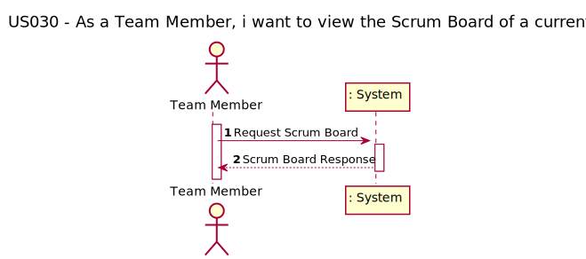
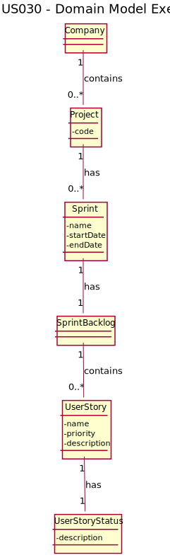
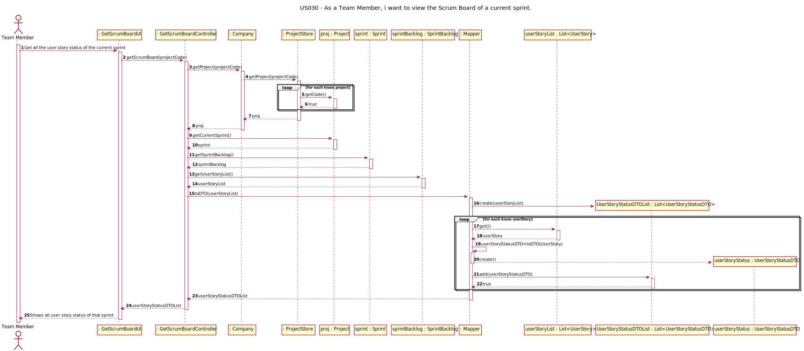
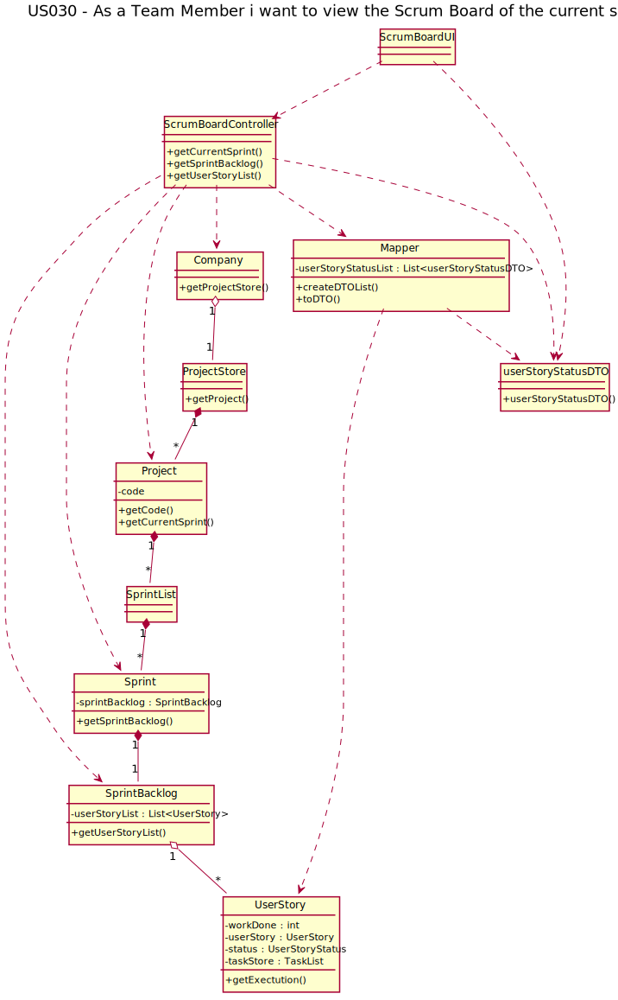

# US030 - As a Team Member, i want to view the Scrum Board of a current sprint.

## 1. Requirements Engineering

*In this section, it is suggested to capture the requirement description and specifications as provided by the client as well as any further clarification on it. It is also suggested to capture the requirements acceptance criteria and existing dependencies to other requirements. At last, identfy the involved input and output data and depicted an Actor-System interaction in order to fulfill the requirement.*

### 1.1. User Story Description

As a Team Member i want to view the Scrum Board of the current sprint

### 1.2. Customer Specifications and Clarifications 

*Insert here any related specification and/or clarification provided by the client together with **your interpretation**. When possible, provide a link to such specifications/clarifications.*

### 1.3. Acceptance Criteria

*Insert here the client acceptance criteria.*

### 1.4. Found out Dependencies

This US have a dependency to this user stories:
- US001 - Register a user;
- US002 - Activate user account;

### 1.5 Input and Output Data

To get the the user storys of a sprint and their status, i.e. the scrum board category, the actor must choose the 
option to get the list of user story of the current sprint of a project.

This process will be return a  dto list with user story name, description and their status, of the current project sprint.

### 1.6. System Sequence Diagram (SSD)

*Insert here a SSD depicting the envisioned Actor-System interactions and throughout which data is inputted and outputted to fulfill the requirement. All interactions must be numbered.*

### 1.7 Other Relevant Remarks

*Use this section to capture other relevant information that is related with this US such as (i) special requirements ; (ii) data and/or technology variations; (iii) how often this US is held.* 

## 2. OO Analysis

### 2.1. Relevant Domain Model Excerpt 
*In this section, it is suggested to present an excerpt of the domain model that is seen as relevant to fulfill this requirement.* 

### 2.2. Other Remarks

*Use this section to capture some aditional notes/remarks that must be taken into consideration into the design activity. In some case, it might be usefull to add other analysis artifacts (e.g. activity or state diagrams).* 

## 3. Design - User Story Realization 

### 3.1. Rationale

**The rationale grounds on the SSD interactions and the identified input/output data.**

| Interaction ID | Question: Which class is responsible for... | Answer  | Justification (with patterns)  |
|:-------------  |:--------------------- |:------------|:---------------------------- |
| Step 1  		 |		Get User Story and their Status				 |      SprintBacklog       |        GRASP - Pure Fabrication / HC + LC                        |
| Step 2  		 |					Interact wit UI	 |     Controller       |      GRASP - Controller          |
| Step 3  		 |					How to pass data between systems and reduce coupling	 |       Create UserStoryDTO     |            DTO Pattern          |
| Step 4  		 |				How to create and manage DTO	 |         UserStoryMapper     |                       Mapper Pattern            |

### Systematization ##

According to the taken rationale, the conceptual classes promoted to software classes are: 

 * ProjectStore
 * Project
 * Sprint
 * SprintBacklog
 * UserStory

Other software classes (i.e. Pure Fabrication) identified: 

  * GetScrumBoardUI
  * GetScrumBoardController
  * UserStoryMapper
  * UserStoryDto

## 3.2. Sequence Diagram (SD)

*In this section, it is suggested to present an UML dynamic view stating the sequence of domain related software objects' interactions that allows to fulfill the requirement.* 

## 3.3. Class Diagram (CD)

*In this section, it is suggested to present an UML static view representing the main domain related software classes that are involved in fulfilling the requirement as well as and their relations, attributes and methods.*

# 4. Tests 
We try to think about how we want to test each class and method used in this US,
therefore we have listed the tests below:

| Class                          | Test Goal                                                  |
|:-------------------------------|:-----------------------------------------------------------|
| GetScrumBoardController | 	Ensure that the methods return a list                     |
| GetScrumBoardController     | 	Ensure that the methods return an empty list              |
| GetScrumBoardController       | 	Ensure that created DTO list contains correct information |
| GetScrumBoardController      | 	Ensure that Mapper and DTO pattern were working           |

    getScrumBoardControllerTest() {
        //Arrange
        Company company = new Company();

        Typology typo = company.getTypologyStore().getTypology("Fixed Cost");
        Customer customer = company.getCustomerStore().getCustomerByName("Teste");
        BusinessSector sector = company.getBusinessSectorStore().getBusinessSectorByDescription("sector");
        Project project = company.getProjectStore().createProject( "prototype", "test1234", customer,
                typo, sector, LocalDate.now(), 7, 5000);

        Sprint sprint = project.getSprints().createSprint("Sprint 1", LocalDate.now(), 2);
        project.getSprints().saveSprint(sprint);

        company.getProjectStore().saveNewProject(project);
        UserStory userStory = company.getProjectStore().getProjectByCode("Project_2022_1").getUserStoryStore().createUserStory( "US001",
                1, "Fazer coisas cool",5);
        company.getProjectStore().getProjectByCode("Project_2022_1").getUserStoryStore().saveUserStory(userStory);
        company.getProjectStore().getProjectByCode("Project_2022_1").getSprints().getCurrentSprint().getSprintBacklog().saveUserStoryToSprintBacklog(userStory);

        //
        ScrumBoardMapper mapper = new ScrumBoardMapper();
        GetScrumBoardController controller = new GetScrumBoardController(company,mapper);

        assertEquals(controller.getScrumBoard("Project_2022_1").get(0),mapper.toDTO(userStory));
    }

# 6. Integration and Demo 

Because many of the usage classes were already made and yours business logic were consolidated,
the integration with them was simple. We need to verify some rules and implement others,
but most of our work was devoted to the design and tests.

# 6. Observations

As team, we need to better understand how to think about and define the tests that will be performed.

