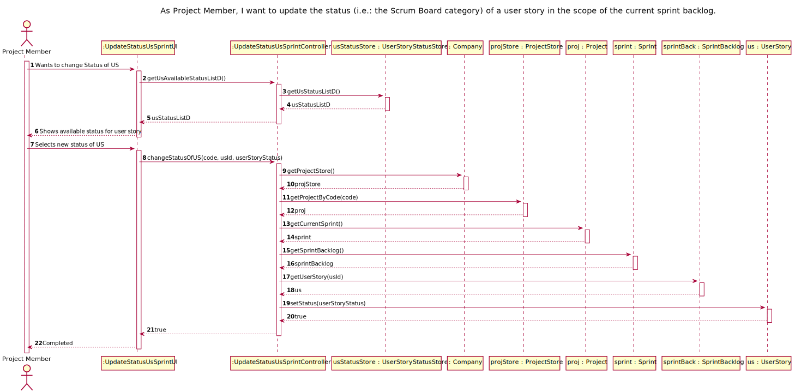
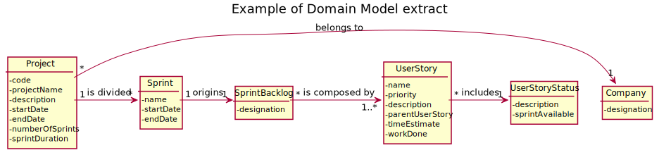
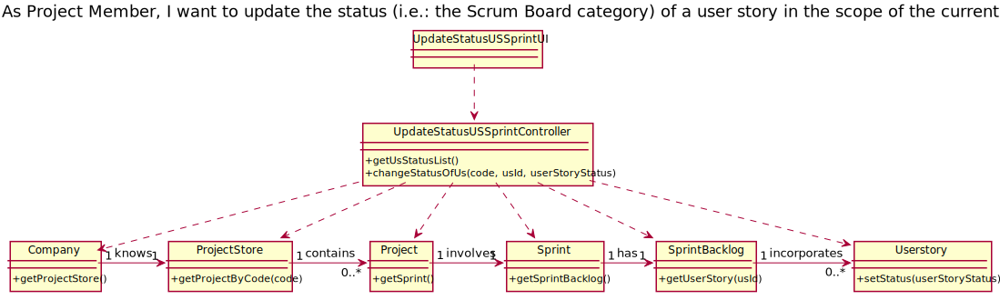

# US 034 - As Project Member, I want to update the status (i.e.: the Scrum Board category) of a user story in the scope of the current sprint backlog.

## 1. Requirements Engineering

In scrum, the requirements of the project are expressed as ***user stories*** and the set of all user stories is the ***project backlog***.

The project timeline is divided into sprints (multiple of weeks). Each sprint has a ***sprint backlog***, i.e. the set of user stories that should be addressed during the sprint.
A user story contains a ***status***, when is in the current Product Backlog, and a new set of ***status*** when is selected to a Sprint Backlog.

### 1.1. User Story Description

As Project Member, I want to update the status (i.e.: the Scrum Board category) of a user story in the scope of the current sprint backlog.

### 1.2. Customer Specifications and Clarifications

***Team Ask*** - Is it necessary to validate that each task belonging to the user story is completed, in order to change the status of the user story to completed?

***PO Answer*** - For now that verification will not be necessary.

We consider the following interpretations:

- In the selection of the Status of a UserStory in the scope of the sprint backlog:
  - **Available in Sprint Backlog**: When a UserStory is in the Sprint Backlog will only be able to have some selected Status (To do, In progress and Done)
  - **Initial Status**: the initial status when moved to the Sprint Backlog will be ***"To do"***.

### 1.3. Acceptance Criteria

- ACP001: each Status will be identified by an ID, attributed automatically;
- ACP002: description must have at least 3 (three) characters;
- ACP003: each Status will have a boolean attribute to confirm if said Status can be used in Sprint Backlog.

### 1.4. Found out Dependencies

This US have a dependency to this user stories: 
- US001 - Register a user;
- US002 - Activate user account;
- US005 - Create a project;
- US009 - Create a Userstory in a Product Backlog.
- US022 - Create a sprint in a project;
- US029 - Start a sprint in a project.
- US023 - Add a UserStory from the Product Backlog to the Sprint Backlog.

### 1.5 Input and Output Data

####Input Data
- To change the Status of a UserStory, the actor must choose a parameter:
    - **Status**: select one Status from a provided list of Status;

####Output Data

This process will be only a return message with the state of the creation. In other words, success or fail.  

### 1.6. System Sequence Diagram (SSD)

## 2. OO Analysis

### 2.1. Relevant Domain Model Excerpt  

## 3. Design - User Story Realization 

//TO BE CONTINUED FROM HERE
### 3.1. Rationale

**The rationale grounds on the SSD interactions and the identified input/output data.**

| Interaction ID | Question: Which class is responsible for... | Answer  | Justification (with patterns)  |
|:-------------  |:--------------------- |:------------|:---------------------------- |
| Step 1  		 |	Create and manage Task|TaskList|GRASP - Pure Fabrication / HC + LC|
| Step 2  		 |	Iterate with UI|Controller|GRASP - Controller|
| Step 3  		 |	How to pass data between systems and reduce coupling|CreateTaskDTO|DTO Pattern|
| Step 4  		 |	How to create and manage DTO|TaskMapper|Mapper Pattern|
| Step 4  		 |	Create and manage TaskType|TaskTypeStore|GRASP - Pure Fabrication / HC + LC|
| Step 5  		 |	Create and manage TaskStatus|TaskStatusStore|GRASP - Pure Fabrication / HC + LC| 

### Systematization ##

According to the taken rationale, the conceptual classes promoted to software classes are: 

 * Task
 * TaskType
 * TaskStatus

Other software classes (i.e. Pure Fabrication) identified: 
 * CreateSprintTaskUI  
 * CreateSprintTaskController
 * TaskTypeStore
 * TaskStatusStore
 * TaskList
 * CreateTaskDTO
 * TaskMapper

## 3.2. Sequence Diagram (SD)

*In this section, it is suggested to present an UML dynamic view stating the sequence of domain related software objects' interactions that allows to fulfill the requirement.* 

## 3.3. Class Diagram (CD)

# 4. Tests 

We try to think about how we want to test each class and method used in this US, 
therefore we have listed the tests below:

###4.1. Controller tests

| Class | Test Goal |
|:-------------  |:--------------------- |
| CreateSprintTaskController |	Ensure that the methods return a list|
| CreateSprintTaskController |	Ensure that the methods return a empty list|
| CreateSprintTaskController |	Ensure that the methods work with many scenarios to create a new task|
| CreateSprintTaskController |	Ensure that Mapper and DTO pattern were working|

        createFirstSprintTask() {
        //Arrange
        Company company = new Company();
        TaskMapper mapper = new TaskMapper();
        CreateSprintTaskController controller = new CreateSprintTaskController(company, mapper);

        //Create a project
        Typology typo = company.getTypologyStore().getTypologyByDescription("Fixed Cost");
        Customer customer = company.getCustomerStore().getCustomerByName("Teste");
        BusinessSector sector = company.getBusinessSectorStore().getBusinessSectorByDescription("sector");
        Project project = company.getProjectStore().createProject( "prototype", "test1234", customer,
                typo, sector, LocalDate.now(), 7, 5000);
        company.getProjectStore().saveNewProject(project);

        //Create a sprint
        Sprint sprint = project.getSprints().createSprint("Sprint 1", LocalDate.of(2022, 2, 1), 2);
        project.getSprints().saveSprint(sprint);

        //Create project team
        UserProfile profile = company.getUserProfileStore().getUserProfile("Visitor");
        SystemUser user1 = new SystemUser("user test", "test@test.pt", "test", "encript", "encript", "photo", profile);
        Resource res1 = new Resource(user1, LocalDate.of(2022, 2, 1), LocalDate.of(2023, 2, 1), 100, 1);
        SystemUser user2 = new SystemUser("user test2", "test2@test.pt", "test", "encript", "encript", "photo", profile);
        Resource res2 = new Resource(user2, LocalDate.of(2022, 2, 1), LocalDate.of(2023, 2, 1), 100, 1);
        SystemUser user3 = new SystemUser("user test3", "test@test.pt", "test", "encript", "encript", "photo", profile);
        Resource res3 = new Resource(user3, LocalDate.of(2022, 2, 1), LocalDate.of(2023, 2, 1), 100, 1);
        project.getProjectTeam().saveResource(res1);
        project.getProjectTeam().saveResource(res2);
        project.getProjectTeam().saveResource(res3);

            //Create a new Sprint Task
        controller.getSprintTasks(project.getCode(), sprint.getId_Sprint());
        CreateTaskDTO dto = new CreateTaskDTO("newTask", "newTask to a controller test", 10, "deployment", "user test3");

        //Asserts
        assertTrue(controller.createSprintTask(dto));
        assertEquals(1, sprint.getTaskList().getTasksNames().size());
        assertEquals("newTask", sprint.getTaskList().getTasksNames().get(0));
    }

###4.1. Model tests

| Class | Test Goal |
|:-------------  |:--------------------- |
| Task |	Ensure that all creation rules are work|
| Task |	check if Tell Don't Ask methods are work|
| TaskList |	check if the initial list are empty|
| TaskList |	check if can't add equals object to the list|
| TaskList |	check if is creating new tasks correctly|
| TaskType |	Ensure that all creation rules are work|
| TaskType |	check if Tell Don't Ask methods are work|
| TaskStatus |	Ensure that all creation rules are work|
| TaskStatus |	check if Tell Don't Ask methods are work|
| TaskTypeStore |	check if the initial list is right|
| TaskTypeStore |	check if can't add equals object to the list|
| TaskTypeStore |	check if is creating new task types correctly|
| TaskStatusStore |	check if the initial list is right|
| TaskStatusStore |	check if can't add equals object to the list|
| TaskStatusStore |	check if is creating new task status correctly|
| ProjectTeam |	check if the project team names list are the current|

- *Ensure that all creation rules are work:*

        constructorCheckNameEmptyTest() {
        //Arrange
        Company company = new Company();
        UserProfile profile = company.getUserProfileStore().getUserProfile("Visitor");
        SystemUser user = new SystemUser("manuelbras", "manuelbras@beaver.com", "tester", "ghi", "ghi", "photo", profile);
        LocalDate startDateMb = LocalDate.of(2022, 1, 1);
        LocalDate endDateMb = LocalDate.of(2022, 1, 31);
        Resource resource = new Resource(user, startDateMb, endDateMb, 100, .5);
        String taskDescription = "must be at least 20 characters";
        TaskType taskType = company.getTaskTypeStore().getTypeByName("Testing");

        //Asserts
        assertThrows(IllegalArgumentException.class, () -> {
            //Arrange
            new Task("", taskDescription, 20.00, taskType, resource);
        });
        }

- *Check if it can't add equals object to the list:*

        createSprintTaskTestRepeated() {
        //Arrange
        Company comp = new Company();
        TaskList test = new TaskList();
        TaskMapper map = new TaskMapper();
        CreateTaskDTO dto = new CreateTaskDTO("test", "test test test tests", 10, "Meeting", "user test");
        CreateTaskDTO dto2 = new CreateTaskDTO("test", "test test test tests", 10, "Meeting", "user test");

        // Create Project
        Customer cust = new Customer("test", "test@test.pt");
        Typology typo = new Typology("test123");
        BusinessSector busSec = new BusinessSector("t1234");
        ProjectStatus status = new ProjectStatus("test1234");
        Project proj = new Project("project", "project test", cust, typo, busSec, LocalDate.of(2022, 2, 1), status, 4, 7000);
        comp.getProjectStore().saveNewProject(proj);
        UserProfile profile = comp.getUserProfileStore().getUserProfile("Visitor");
        SystemUser user = new SystemUser("user test", "test@test.pt", "test", "encript", "encript", "photo", profile);
        Resource resource = proj.getProjectTeam().createResource(user, LocalDate.of(2022, 2, 1), LocalDate.of(2023, 2, 1), 100, 1);
        proj.getProjectTeam().saveResource(resource);

        test.createSprintTask(dto, map, proj);
        test.createSprintTask(dto2, map, proj);

        //Asserts
        assertEquals(1, test.getTasksNames().size());
        assertEquals("test", test.getTasksNames().get(0));
        }

# 6. Integration and Demo

Because many of the usage classes were already made and yours business logic were consolidated, 
the integration with them was simple. We need to verify some rules and implement others, 
but most of our work was devoted to the design and tests.      

# 6. Observations

As team, we need to better understand how to think about and define the tests that will be performed.

